# columbus-travel Design System

You are building UI for **columbus-travel**. Light-themed, neutral palette, sans-serif typography (Arial), standard density on a 5px grid, expressive motion.

## Visual Reference

**IMPORTANT**: Study ALL screenshots below before writing any UI. Match colors, typography, spacing, layout, and motion exactly as shown.

### Homepage

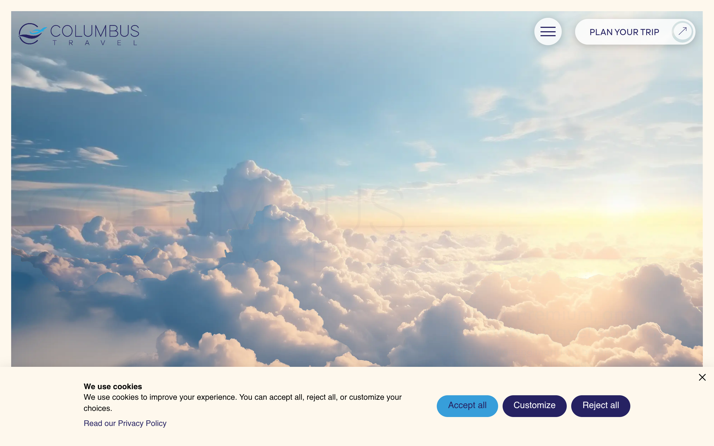

### Scroll Journey (Cinematic Visual States)

> These screenshots capture the website at different scroll depths. The design changes dramatically as you scroll — each frame shows a different cinematic state. Replicate these exact visual transitions.

#### 0% — Hero / Above the fold

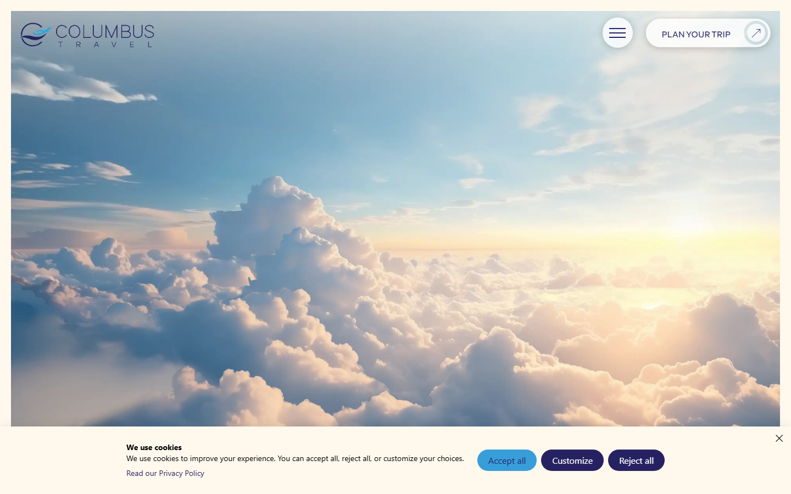

#### 17% — Mid-page at 17% scroll

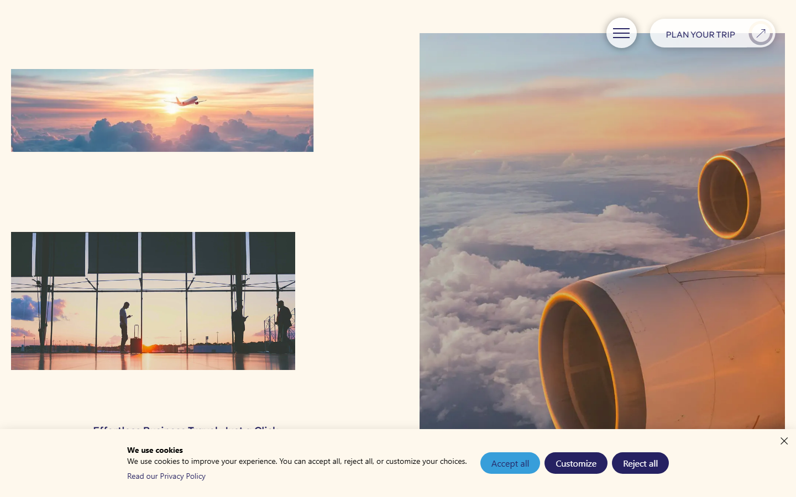

#### 33% — Mid-page at 33% scroll

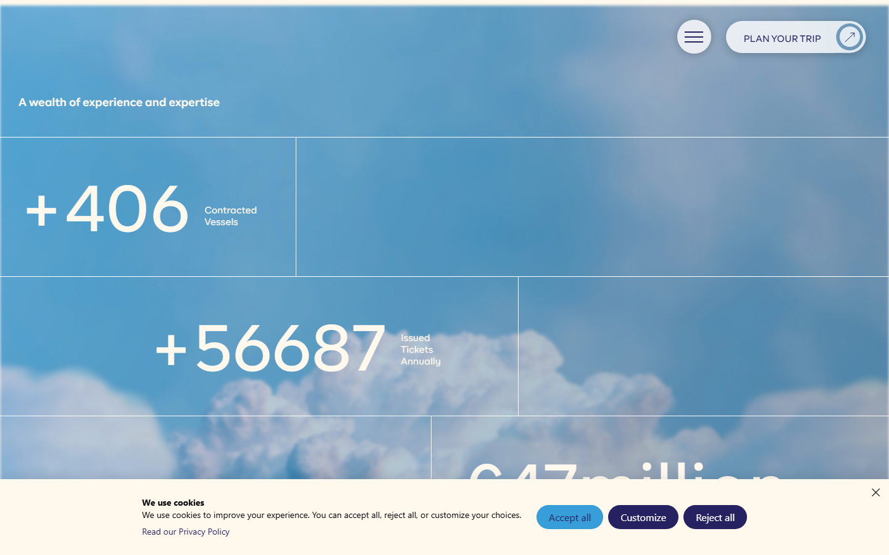

#### 50% — Mid-page at 50% scroll

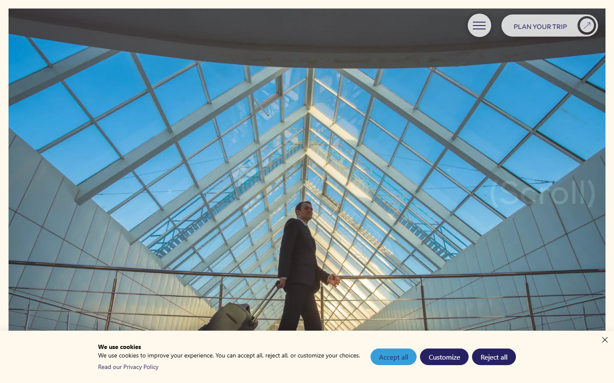

#### 67% — Mid-page at 67% scroll

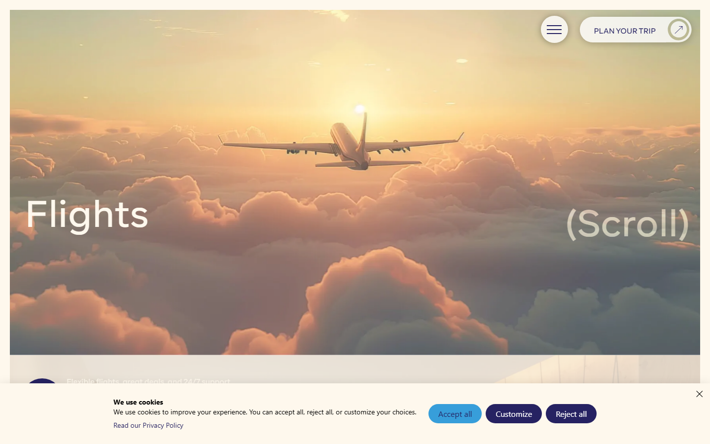

#### 83% — Mid-page at 83% scroll

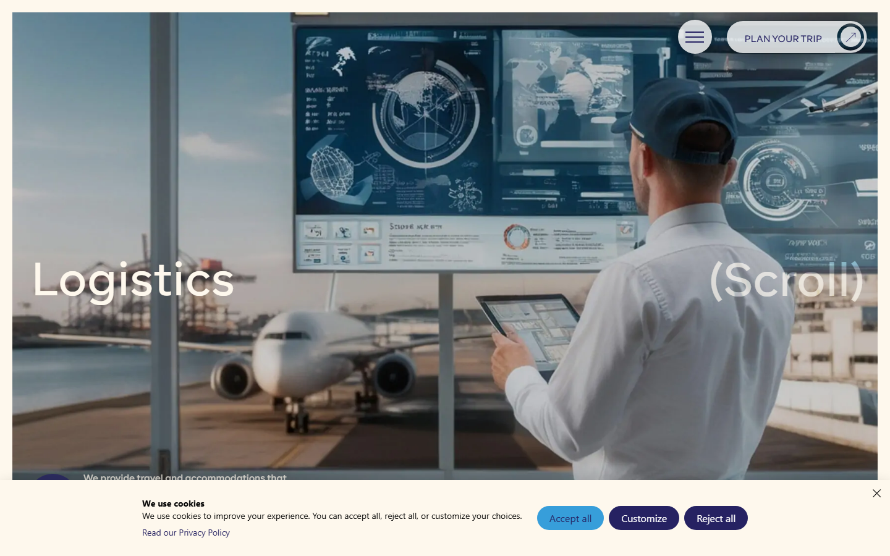

#### 100% — Footer / End of page

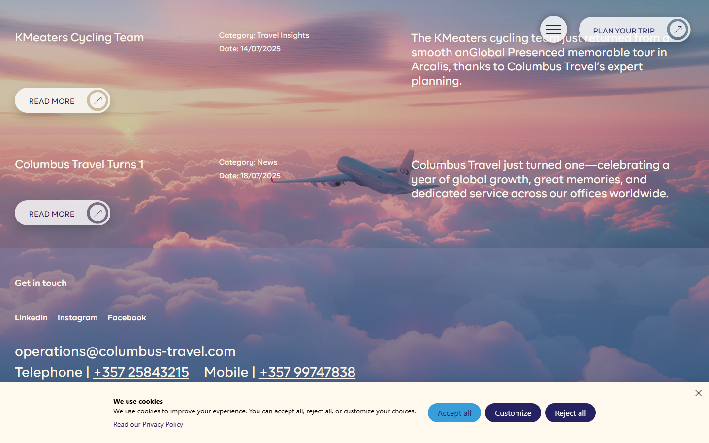

> Read `references/DESIGN.md` for full token details. Read `references/ANIMATIONS.md` for motion specs. Read `references/LAYOUT.md` for layout structure. Read `references/COMPONENTS.md` for component patterns.

## Ultra Reference Files

This package includes extended documentation. **Read these files before implementing:**

| File | Contents |
|------|----------|
| `references/DESIGN.md` | Full design system tokens, colors, typography, spacing |
| `references/VISUAL_GUIDE.md` | **START HERE** — Master visual guide with all screenshots embedded |
| `references/ANIMATIONS.md` | CSS keyframes, scroll triggers, motion library stack, video specs |
| `references/LAYOUT.md` | Flex/grid containers, page structure, spacing relationships |
| `references/COMPONENTS.md` | DOM component patterns, HTML structure, class fingerprints |
| `references/INTERACTIONS.md` | Hover/focus states with before/after style diffs |
| `screens/scroll/` | 7 scroll journey screenshots showing cinematic states |

### Animation Stack Detected

- **GSAP** v3.12.5 — animation
- **ScrollTrigger** — scroll
- **Web Animations API (5 active)** — animation

## Design Philosophy

- **Layered depth** — use shadow tokens to create a sense of physical layering. Each elevation level has a specific shadow.
- **Gradient accents** — gradients are used thoughtfully for emphasis, not decoration.
- **Type pairing** — Arial for body/UI text, swiper-icons for headings/display. Never introduce a third typeface.
- **standard density** — 5px base grid. Every dimension is a multiple of 5.
- **neutral palette** — the color temperature runs neutral, matching the sans-serif typography.
- **Expressive motion** — animations are an integral part of the experience. Use spring physics and layout animations.

## Color System

### Core Palette

| Role | Token | Hex | Use |
|------|-------|-----|-----|
| Background | `--background` | `#ffffff` | Page/app background |
| Surface | `--surface` | `#000000` | Cards, panels, modals |
| Text Primary | `--text-primary` | `#f3f3f3` | Headings, body text |
| Text Muted | `--text-muted` | `#2b2b2b` | Captions, placeholders |
| Border | `--border` | `#3b3b3b` | Dividers, card borders |

### Status Colors

| Status | Hex | Use |
|--------|-----|-----|
| Success | `#198754` | Confirmations, positive trends |
| Warning | `#ffc107` | Caution states, pending items |
| Danger | `#dc3545` | Errors, destructive actions |

### Extended Palette

- **rfc-acc-text:** `#262262`
- `#27aae1`
- `#eae4da` — Light surface or highlight color
- **bs-primary:** `#0d6efd`
- `#639cd6`
- **bs-secondary-bg-subtle:** `#e2e8f0` — Secondary text, placeholder text
- `#001b54`
- **bs-info:** `#0dcaf0`

### CSS Variable Tokens

```css
--bs-primary: #0d6efd;
--bs-secondary: #6c757d;
--bs-primary-rgb: 13,110,253;
--bs-secondary-rgb: 108,117,125;
--bs-primary-text-emphasis: #052c65;
--bs-secondary-text-emphasis: #2b2f32;
--bs-primary-bg-subtle: #cfe2ff;
--bs-secondary-bg-subtle: #e2e3e5;
--bs-primary-border-subtle: #9ec5fe;
--bs-secondary-border-subtle: #c4c8cb;
--bs-success-border-subtle: #a3cfbb;
--bs-info-border-subtle: #9eeaf9;
--bs-warning-border-subtle: #ffe69c;
--bs-danger-border-subtle: #f1aeb5;
--bs-light-border-subtle: #e9ecef;
--bs-dark-border-subtle: #adb5bd;
--bs-secondary-color: rgba(33,37,41,0.75);
--bs-secondary-color-rgb: 33,37,41;
--bs-secondary-bg: #e9ecef;
--bs-secondary-bg-rgb: 233,236,239;
```

## Typography

### Font Stack

- **Arial** — Heading 1, Heading 2, Heading 3
- **swiper-icons** — Body, Caption

### Font Sources

```css
@font-face {
  font-family: "BR Firma";
  src: url("fonts/BRFirma-Regular.woff2") format("woff2");
  font-weight: 400;
}
@font-face {
  font-family: "swiper-icons";
  src: url("data:application/font-woff;charset=utf-8;base64, d09GRgABAAAAAAZgABAAAAAADAAAAAAAAAAAAAAAAAAAAAAAAAAAAAAAAABGRlRNAAAGRAAAABoAAAAci6qHkUdERUYAAAWgAAAAIwAAACQAYABXR1BPUwAABhQAAAAuAAAANuAY7+xHU1VCAAAFxAAAAFAAAABm2fPczU9TLzIAAAHcAAAASgAAAGBP9V5RY21hcAAAAkQAAACIAAABYt6F0cBjdnQgAAACzAAAAAQAAAAEABEBRGdhc3AAAAWYAAAACAAAAAj//wADZ2x5ZgAAAywAAADMAAAD2MHtryVoZWFkAAABbAAAADAAAAA2E2+eoWhoZWEAAAGcAAAAHwAAACQC9gDzaG10eAAAAigAAAAZAAAArgJkABFsb2NhAAAC0AAAAFoAAABaFQAUGG1heHAAAAG8AAAAHwAAACAAcABAbmFtZQAAA/gAAAE5AAACXvFdBwlwb3N0AAAFNAAAAGIAAACE5s74hXjaY2BkYGAAYpf5Hu/j+W2+MnAzMYDAzaX6QjD6/4//Bxj5GA8AuRwMYGkAPywL13jaY2BkYGA88P8Agx4j+/8fQDYfA1AEBWgDAIB2BOoAeNpjYGRgYNBh4GdgYgABEMnIABJzYNADCQAACWgAsQB42mNgYfzCOIGBlYGB0YcxjYGBwR1Kf2WQZGhhYGBiYGVmgAFGBiQQkOaawtDAoMBQxXjg/wEGPcYDDA4wNUA2CCgwsAAAO4EL6gAAeNpj2M0gyAACqxgGNWBkZ2D4/wMA+xkDdgAAAHjaY2BgYGaAYBkGRgYQiAHyGMF8FgYHIM3DwMHABGQrMOgyWDLEM1T9/w8UBfEMgLzE////P/5//f/V/xv+r4eaAAeMbAxwIUYmIMHEgKYAYjUcsDAwsLKxc3BycfPw8jEQA/gZBASFhEVExcQlJKWkZWTl5BUUlZRVVNXUNTQZBgMAAMR+E+gAEQFEAAAAKgAqACoANAA+AEgAUgBcAGYAcAB6AIQAjgCYAKIArAC2AMAAygDUAN4A6ADyAPwBBgEQARoBJAEuATgBQgFMAVYBYAFqAXQBfgGIAZIBnAGmAbIBzgHsAAB42u2NMQ6CUAyGW568x9AneYYgm4MJbhKFaExIOAVX8ApewSt4Bic4AfeAid3VOBixDxfPYEza5O+Xfi04YADggiUIULCuEJK8VhO4bSvpdnktHI5QCYtdi2sl8ZnXaHlqUrNKzdKcT8cjlq+rwZSvIVczNiezsfnP/uznmfPFBNODM2K7MTQ45YEAZqGP81AmGGcF3iPqOop0r1SPTaTbVkfUe4HXj97wYE+yNwWYxwWu4v1ugWHgo3S1XdZEVqWM7ET0cfnLGxWfkgR42o2PvWrDMBSFj/IHLaF0zKjRgdiVMwScNRAoWUoH78Y2icB/yIY09An6AH2Bdu/UB+yxopYshQiEvnvu0dURgDt8QeC8PDw7Fpji3fEA4z/PEJ6YOB5hKh4dj3EvXhxPqH/SKUY3rJ7srZ4FZnh1PMAtPhwP6fl2PMJMPDgeQ4rY8YT6Gzao0eAEA409DuggmTnFnOcSCiEiLMgxCiTI6Cq5DZUd3Qmp10vO0LaLTd2cjN4fOumlc7lUYbSQcZFkutRG7g6JKZKy0RmdLY680CDnEJ+UMkpFFe1RN7nxdVpXrC4aTtnaurOnYercZg2YVmLN/d/gczfEimrE/fs/bOuq29Zmn8tloORaXgZgGa78yO9/cnXm2BpaGvq25Dv9S4E9+5SIc9PqupJKhYFSSl47+Qcr1mYNAAAAeNptw0cKwkAAAMDZJA8Q7OUJvkLsPfZ6zFVERPy8qHh2YER+3i/BP83vIBLLySsoKimrqKqpa2hp6+jq6RsYGhmbmJqZSy0sraxtbO3sHRydnEMU4uR6yx7JJXveP7WrDycAAAAAAAH//wACeNpjYGRgYOABYhkgZgJCZgZNBkYGLQZtIJsFLMYAAAw3ALgAeNolizEKgDAQBCchRbC2sFER0YD6qVQiBCv/H9ezGI6Z5XBAw8CBK/m5iQQVauVbXLnOrMZv2oLdKFa8Pjuru2hJzGabmOSLzNMzvutpB3N42mNgZGBg4GKQYzBhYMxJLMlj4GBgAYow/P/PAJJhLM6sSoWKfWCAAwDAjgbRAAB42mNgYGBkAIIbCZo5IPrmUn0hGA0AO8EFTQAA");
  font-weight: 400;
}
```

### Type Scale

| Role | Family | Size | Weight |
|------|--------|------|--------|
| Heading 1 | Arial | 5rem | 700 |
| Heading 2 | Arial | 4.5rem | 700 |
| Heading 3 | Arial | clamp(65px,20.833vw,400px) | 700 |
| Body | swiper-icons | 1.25rem | 400 |
| Caption | swiper-icons | 16px | 400 |

### Typography Rules

- Body/UI: **Arial**, Headings: **swiper-icons** — these are the only display fonts
- Max 3-4 font sizes per screen
- Headings: weight 600-700, body: weight 400
- Use color and opacity for text hierarchy, not additional font sizes
- Line height: 1.5 for body, 1.2 for headings

## Spacing & Layout

### Base Grid: 5px

Every dimension (margin, padding, gap, width, height) must be a multiple of **5px**.

### Spacing Scale

`5, 10, 15, 20, 25, 30, 35, 40, 45, 50, 55, 60` px

### Spacing as Meaning

| Spacing | Use |
|---------|-----|
| 2.5-5px | Tight: related items within a group |
| 10px | Medium: between groups |
| 15-20px | Wide: between sections |
| 30px+ | Vast: major section breaks |

### Border Radius

Scale: `.25rem, .25em, .375rem, 1rem, 2em, 5px, 6px, 8px, 10px, 12px, 15px, 20px, 30px, 35px, 35px 0px 0px 35px, 50px, 100%, 100px, 999px, inherit, 40px, clamp(20px,1.979vw,38px), clamp(80px,7.396vw,142px), 107px`
Default: `30px`

### Container

Max-width: `991px`, centered with auto margins.

### Breakpoints

| Name | Value |
|------|-------|
| sm | 575px |
| sm | 575.98px |
| sm | 576px |
| sm | 600px |
| md | 767px |
| md | 767.98px |
| md | 768px |
| lg | 800px |
| lg | 900px |
| lg | 991px |
| lg | 991.98px |
| lg | 992px |
| lg | 992.98px |
| xl | 1099px |
| xl | 1199px |
| xl | 1199.98px |
| xl | 1200px |
| 2xl | 1299px |
| 2xl | 1299.98px |
| 2xl | 1399px |
| 2xl | 1399.98px |
| 2xl | 1400px |

Mobile-first: design for small screens, layer on responsive overrides.

## Component Patterns

### Card

```css
.card {
  background: #000000;
  border: 1px solid #3b3b3b;
  border-radius: 30px;
  padding: 20px;
  box-shadow: 0 0 0 .25rem rgba(13,110,253,.25);
}
```

```html
<div class="card">
  <h3>Card Title</h3>
  <p>Card content goes here.</p>
</div>
```

### Button

```css
/* Primary */
.btn-primary {
  background: #cccccc;
  color: #f3f3f3;
  border-radius: 30px;
  padding: 10px 20px;
  font-weight: 500;
  transition: opacity 150ms ease;
}
.btn-primary:hover { opacity: 0.9; }

/* Ghost */
.btn-ghost {
  background: transparent;
  border: 1px solid #3b3b3b;
  color: #f3f3f3;
  border-radius: 30px;
  padding: 10px 20px;
}
```

```html
<button class="btn-primary">Get Started</button>
<button class="btn-ghost">Learn More</button>
```

### Input

```css
.input {
  background: #ffffff;
  border: 1px solid #3b3b3b;
  border-radius: 30px;
  padding: 10px 15px;
  color: #f3f3f3;
  font-size: 14px;
}
.input:focus { border-color: var(--accent); outline: none; }
```

```html
<input class="input" type="text" placeholder="Search..." />
```

### Badge / Chip

```css
.badge {
  display: inline-flex;
  align-items: center;
  padding: 5px 10px;
  border-radius: 9999px;
  font-size: 12px;
  font-weight: 500;
  background: #000000;
  color: #2b2b2b;
}
```

```html
<span class="badge">New</span>
<span class="badge">Beta</span>
```

### Modal / Dialog

```css
.modal-backdrop { background: rgba(0, 0, 0, 0.6); }
.modal {
  background: #000000;
  border: 1px solid #3b3b3b;
  border-radius: 107px;
  padding: 30px;
  max-width: 480px;
  width: 90vw;
  box-shadow: 0px 0px 14px rgba(0,0,0,0.4);
}
```

```html
<div class="modal-backdrop">
  <div class="modal">
    <h2>Dialog Title</h2>
    <p>Dialog content.</p>
    <button class="btn-primary">Confirm</button>
    <button class="btn-ghost">Cancel</button>
  </div>
</div>
```

### Table

```css
.table { width: 100%; border-collapse: collapse; }
.table th {
  text-align: left;
  padding: 10px 15px;
  font-weight: 500;
  font-size: 12px;
  color: #2b2b2b;
  text-transform: uppercase;
  letter-spacing: 0.05em;
  border-bottom: 1px solid #3b3b3b;
}
.table td {
  padding: 15px;
  border-bottom: 1px solid #3b3b3b;
}
```

```html
<table class="table">
  <thead><tr><th>Name</th><th>Status</th><th>Date</th></tr></thead>
  <tbody>
    <tr><td>Item One</td><td>Active</td><td>Jan 1</td></tr>
    <tr><td>Item Two</td><td>Pending</td><td>Jan 2</td></tr>
  </tbody>
</table>
```

### Navigation

```css
.nav {
  display: flex;
  align-items: center;
  gap: 10px;
  padding: 15px 20px;
  border-bottom: 1px solid #3b3b3b;
}
.nav-link {
  color: #2b2b2b;
  padding: 10px 15px;
  border-radius: 30px;
  transition: color 150ms;
}
.nav-link:hover { color: #f3f3f3; }
```

```html
<nav class="nav">
  <a href="/" class="nav-link active">Home</a>
  <a href="/about" class="nav-link">About</a>
  <a href="/pricing" class="nav-link">Pricing</a>
  <button class="btn-primary" style="margin-left: auto">Get Started</button>
</nav>
```

### Extracted Components

These components were found in the codebase:

**Button** (`html`)

**Navigation** (`html`)

## Page Structure

The following page sections were detected:

- **Navigation** — Top navigation bar (11 items)
- **Hero** — Hero/banner section with headline and CTAs
- **Faq** — FAQ/accordion section
- **Footer** — Page footer with links and info (14 items)
- **Stats** — Statistics/metrics display

When building pages, follow this section order and structure.

## Animation & Motion

This project uses **expressive motion**. Animations are part of the design language.

### CSS Animations

- `progress-bar-stripes`
- `spinner-border`
- `spinner-grow`
- `placeholder-glow`
- `placeholder-wave`

### Motion Tokens

- **Duration scale:** `0ms`, `100ms`, `150ms`, `200ms`, `300ms`, `350ms`, `400ms`, `500ms`, `600ms`, `700ms`, `1000ms`
- **Easing functions:** `ease-in-out`, `linear`, `ease`, `ease-out`, `cubic-bezier(0.4,0,0.2,1)`

### Motion Guidelines

- **Duration:** Use values from the duration scale above. Short (0ms) for micro-interactions, long (1000ms) for page transitions
- **Easing:** Use `ease-in-out` as the default easing curve
- **Direction:** Elements enter from bottom/right, exit to top/left
- **Reduced motion:** Always respect `prefers-reduced-motion` — disable animations when set

## Depth & Elevation

### Shadow Tokens

- Subtle: `0 0 0 1px #fff,0 0 0 .25rem rgba(13,110,253,.25)`
- Raised (cards, buttons): `0 0 0 .25rem rgba(13,110,253,.25)`
- Raised (cards, buttons): `0 0 0 .25rem rgba(var(--bs-success-rgb),.25)`
- Raised (cards, buttons): `0 0 0 .25rem rgba(var(--bs-danger-rgb),.25)`
- Raised (cards, buttons): `var(--bs-btn-focus-box-shadow)`
- Raised (cards, buttons): `0 0 0 var(--bs-navbar-toggler-focus-width)`

### Z-Index Scale

`0, 1, 2, 3, 4, 5, 9, 10, 20, 50, 999, 1020, 1030, 1040, 1042, 1043, 1044, 1045, 1046, 99998, 99999, 100000, 100001`

Use these exact values — never invent z-index values.

## Anti-Patterns (Never Do)

- **No blur effects** — no backdrop-blur, no filter: blur()
- **No zebra striping** — tables and lists use borders for separation
- **No invented colors** — every hex value must come from the palette above
- **No arbitrary spacing** — every dimension is a multiple of 5px
- **No extra fonts** — only Arial and swiper-icons are allowed
- **No arbitrary border-radius** — use the scale: .25rem, .25em, .375rem, 1rem, 2em, 5px, 6px, 8px, 10px, 12px
- **No opacity for disabled states** — use muted colors instead

## Workflow

1. **Read** `references/DESIGN.md` before writing any UI code
2. **Pick colors** from the Color System section — never invent new ones
3. **Set typography** — Arial, swiper-icons only, using the type scale
4. **Build layout** on the 5px grid — check every margin, padding, gap
5. **Match components** to patterns above before creating new ones
6. **Apply elevation** — use shadow tokens
7. **Validate** — every value traces back to a design token. No magic numbers.

## Brand Spec

- **Favicon:** `https://columbus-travel.com/wp-content/uploads/2025/07/columbus-favicon.png`
- **Site URL:** `https://columbus-travel.com/`
- **Brand typeface:** Arial

## Quick Reference

```
Background:     #ffffff
Surface:        #000000
Text:           #f3f3f3 / #2b2b2b
Accent:         (not extracted)
Border:         #3b3b3b
Font:           Arial
Spacing:        5px grid
Radius:         30px
Components:     8 detected
```

## When to Trigger

Activate this skill when:
- Creating new components, pages, or visual elements for columbus-travel
- Writing CSS, Tailwind classes, styled-components, or inline styles
- Building page layouts, templates, or responsive designs
- Reviewing UI code for design consistency
- The user mentions "columbus-travel" design, style, UI, or theme
- Generating mockups, wireframes, or visual prototypes

---

# Full Reference Files

> Every output file is embedded below. Claude has full design system context from /skills alone.

## Design System Tokens (DESIGN.md)

# columbus-travel DESIGN.md

> Auto-generated design system — reverse-engineered via static analysis by skillui.
> Frameworks: None detected
> Colors: 20 · Fonts: 2 · Components: 8
> Icon library: not detected · State: not detected
> Primary theme: light · Dark mode toggle: no · Motion: expressive

## Visual Reference

**Match this design exactly** — study colors, fonts, spacing, and component shapes before writing any UI code.


---

## 1. Visual Theme & Atmosphere

This is a **light-themed** interface with a neutral, approachable feel. The light background emphasizes content clarity. Typography pairs **swiper-icons** for display/headings with **Arial** for body text, creating clear visual hierarchy through type contrast. Spacing follows a **5px base grid** (standard density), with scale: 5, 10, 15, 20, 25, 30, 35, 40px. Motion is expressive — spring physics, layout animations, and staggered reveals are part of the visual language.

---

## 2. Color Palette & Roles

| Token | Hex | Role | Use |
|---|---|---|---|
| bs-emphasis-color | `#ffffff` | background | Page background, darkest surface |
| bs-emphasis-color | `#000000` | surface | Card and panel backgrounds |
| text-primary | `#f3f3f3` | text-primary | Headings and body text |
| bs-secondary-bg-subtle | `#111111` | text-primary | Headings and body text |
| bs-secondary-text-emphasis | `#2b2b2b` | text-muted | Captions, placeholders, secondary info |
| bs-secondary | `#6c757d` | text-muted | Captions, placeholders, secondary info |
| bs-secondary-bg | `#3b3b3b` | border | Dividers, card borders, outlines |
| bs-danger | `#dc3545` | danger | Error states, destructive actions |
| bs-success | `#198754` | success | Success states, positive indicators |
| bs-warning | `#ffc107` | warning | Warning states, caution indicators |
| rfc-acc-text | `#262262` | info | Informational highlights |
| unknown | `#27aae1` | unknown | Palette color |
| unknown | `#eae4da` | unknown | Palette color |
| bs-primary | `#0d6efd` | unknown | Palette color |
| unknown | `#639cd6` | unknown | Palette color |
| bs-secondary-bg-subtle | `#e2e8f0` | unknown | Palette color |
| unknown | `#001b54` | unknown | Palette color |
| bs-info | `#0dcaf0` | unknown | Palette color |
| bs-secondary-border-subtle | `#cccccc` | unknown | Palette color |
| bs-light-text-emphasis | `#495057` | unknown | Palette color |

### CSS Variable Tokens

```css
--bs-primary: #0d6efd;
--bs-secondary: #6c757d;
--bs-primary-rgb: 13,110,253;
--bs-secondary-rgb: 108,117,125;
--bs-primary-text-emphasis: #052c65;
--bs-secondary-text-emphasis: #2b2f32;
--bs-primary-bg-subtle: #cfe2ff;
--bs-secondary-bg-subtle: #e2e3e5;
--bs-primary-border-subtle: #9ec5fe;
--bs-secondary-border-subtle: #c4c8cb;
--bs-success-border-subtle: #a3cfbb;
--bs-info-border-subtle: #9eeaf9;
--bs-warning-border-subtle: #ffe69c;
--bs-danger-border-subtle: #f1aeb5;
--bs-light-border-subtle: #e9ecef;
--bs-dark-border-subtle: #adb5bd;
--bs-secondary-color: rgba(33,37,41,0.75);
--bs-secondary-color-rgb: 33,37,41;
--bs-secondary-bg: #e9ecef;
--bs-secondary-bg-rgb: 233,236,239;
```


---

## 3. Typography Rules

**Font Stack:**
- **Arial** — Heading 1, Heading 2, Heading 3
- **swiper-icons** — Body, Caption

**Font Sources:**

```css
@font-face {
  font-family: "BR Firma";
  src: url("fonts/BRFirma-Regular.woff2") format("woff2");
  font-weight: 400;
}
@font-face {
  font-family: "swiper-icons";
  src: url("data:application/font-woff;charset=utf-8;base64, d09GRgABAAAAAAZgABAAAAAADAAAAAAAAAAAAAAAAAAAAAAAAAAAAAAAAABGRlRNAAAGRAAAABoAAAAci6qHkUdERUYAAAWgAAAAIwAAACQAYABXR1BPUwAABhQAAAAuAAAANuAY7+xHU1VCAAAFxAAAAFAAAABm2fPczU9TLzIAAAHcAAAASgAAAGBP9V5RY21hcAAAAkQAAACIAAABYt6F0cBjdnQgAAACzAAAAAQAAAAEABEBRGdhc3AAAAWYAAAACAAAAAj//wADZ2x5ZgAAAywAAADMAAAD2MHtryVoZWFkAAABbAAAADAAAAA2E2+eoWhoZWEAAAGcAAAAHwAAACQC9gDzaG10eAAAAigAAAAZAAAArgJkABFsb2NhAAAC0AAAAFoAAABaFQAUGG1heHAAAAG8AAAAHwAAACAAcABAbmFtZQAAA/gAAAE5AAACXvFdBwlwb3N0AAAFNAAAAGIAAACE5s74hXjaY2BkYGAAYpf5Hu/j+W2+MnAzMYDAzaX6QjD6/4//Bxj5GA8AuRwMYGkAPywL13jaY2BkYGA88P8Agx4j+/8fQDYfA1AEBWgDAIB2BOoAeNpjYGRgYNBh4GdgYgABEMnIABJzYNADCQAACWgAsQB42mNgYfzCOIGBlYGB0YcxjYGBwR1Kf2WQZGhhYGBiYGVmgAFGBiQQkOaawtDAoMBQxXjg/wEGPcYDDA4wNUA2CCgwsAAAO4EL6gAAeNpj2M0gyAACqxgGNWBkZ2D4/wMA+xkDdgAAAHjaY2BgYGaAYBkGRgYQiAHyGMF8FgYHIM3DwMHABGQrMOgyWDLEM1T9/w8UBfEMgLzE////P/5//f/V/xv+r4eaAAeMbAxwIUYmIMHEgKYAYjUcsDAwsLKxc3BycfPw8jEQA/gZBASFhEVExcQlJKWkZWTl5BUUlZRVVNXUNTQZBgMAAMR+E+gAEQFEAAAAKgAqACoANAA+AEgAUgBcAGYAcAB6AIQAjgCYAKIArAC2AMAAygDUAN4A6ADyAPwBBgEQARoBJAEuATgBQgFMAVYBYAFqAXQBfgGIAZIBnAGmAbIBzgHsAAB42u2NMQ6CUAyGW568x9AneYYgm4MJbhKFaExIOAVX8ApewSt4Bic4AfeAid3VOBixDxfPYEza5O+Xfi04YADggiUIULCuEJK8VhO4bSvpdnktHI5QCYtdi2sl8ZnXaHlqUrNKzdKcT8cjlq+rwZSvIVczNiezsfnP/uznmfPFBNODM2K7MTQ45YEAZqGP81AmGGcF3iPqOop0r1SPTaTbVkfUe4HXj97wYE+yNwWYxwWu4v1ugWHgo3S1XdZEVqWM7ET0cfnLGxWfkgR42o2PvWrDMBSFj/IHLaF0zKjRgdiVMwScNRAoWUoH78Y2icB/yIY09An6AH2Bdu/UB+yxopYshQiEvnvu0dURgDt8QeC8PDw7Fpji3fEA4z/PEJ6YOB5hKh4dj3EvXhxPqH/SKUY3rJ7srZ4FZnh1PMAtPhwP6fl2PMJMPDgeQ4rY8YT6Gzao0eAEA409DuggmTnFnOcSCiEiLMgxCiTI6Cq5DZUd3Qmp10vO0LaLTd2cjN4fOumlc7lUYbSQcZFkutRG7g6JKZKy0RmdLY680CDnEJ+UMkpFFe1RN7nxdVpXrC4aTtnaurOnYercZg2YVmLN/d/gczfEimrE/fs/bOuq29Zmn8tloORaXgZgGa78yO9/cnXm2BpaGvq25Dv9S4E9+5SIc9PqupJKhYFSSl47+Qcr1mYNAAAAeNptw0cKwkAAAMDZJA8Q7OUJvkLsPfZ6zFVERPy8qHh2YER+3i/BP83vIBLLySsoKimrqKqpa2hp6+jq6RsYGhmbmJqZSy0sraxtbO3sHRydnEMU4uR6yx7JJXveP7WrDycAAAAAAAH//wACeNpjYGRgYOABYhkgZgJCZgZNBkYGLQZtIJsFLMYAAAw3ALgAeNolizEKgDAQBCchRbC2sFER0YD6qVQiBCv/H9ezGI6Z5XBAw8CBK/m5iQQVauVbXLnOrMZv2oLdKFa8Pjuru2hJzGabmOSLzNMzvutpB3N42mNgZGBg4GKQYzBhYMxJLMlj4GBgAYow/P/PAJJhLM6sSoWKfWCAAwDAjgbRAAB42mNgYGBkAIIbCZo5IPrmUn0hGA0AO8EFTQAA");
  font-weight: 400;
}
```

| Role | Font | Size | Weight |
|---|---|---|---|
| Heading 1 | Arial | 5rem | 700 |
| Heading 2 | Arial | 4.5rem | 700 |
| Heading 3 | Arial | clamp(65px,20.833vw,400px) | 700 |
| Body | swiper-icons | 1.25rem | 400 |
| Caption | swiper-icons | 16px | 400 |

**Typographic Rules:**
- Limit to 2 font families max per screen
- Use **Arial** for body/UI text, **swiper-icons** for display/headings
- Maintain consistent hierarchy: no more than 3-4 font sizes per screen
- Headings use bold (600-700), body uses regular (400)
- Line height: 1.5 for body text, 1.2 for headings
- Use color and opacity for secondary hierarchy, not additional font sizes


---

## 4. Component Stylings

### Layout (1)

**Footer** — `html`

### Navigation (1)

**Navigation** — `html`

### Data Display (1)

**List** — `html`

### Data Input (1)

**Button** — `html`
- Animation: 

### Overlay (1)

**Modal** — `html`

### Media (3)

**Image** — `html`

**Icon** — `html`

**Map/Canvas** — `html`


---

## 5. Layout Principles

- **Base spacing unit:** 5px
- **Spacing scale:** 5, 10, 15, 20, 25, 30, 35, 40, 45, 50, 55, 60
- **Border radius:** .25rem, .25em, .375rem, 1rem, 2em, 5px, 6px, 8px, 10px, 12px, 15px, 20px, 30px, 35px, 35px 0px 0px 35px, 50px, 100%, 100px, 999px, inherit, 40px, clamp(20px,1.979vw,38px), clamp(80px,7.396vw,142px), 107px
- **Max content width:** 991px

**Spacing as Meaning:**
| Spacing | Use |
|---|---|
| 2.5-5px | Tight: related items within a group |
| 10px | Medium: between groups |
| 15-20px | Wide: between sections |
| 30px+ | Vast: major section breaks |


---

## 6. Depth & Elevation

### Flat — subtle depth hints

- `0 0 0 1px #fff,0 0 0 .25rem rgba(13,110,253,.25)`

### Raised — cards, buttons, interactive elements

- `0 0 0 .25rem rgba(13,110,253,.25)`
- `0 0 0 .25rem rgba(var(--bs-success-rgb),.25)`
- `0 0 0 .25rem rgba(var(--bs-danger-rgb),.25)`

### Floating — dropdowns, popovers, modals

- `0px 0px 14px rgba(0,0,0,0.4)`
- `0px 3px 14px rgba(0,0,0,0.2)`
- `0px 1px 14px rgba(0,0,0,0.2)`

### Overlay — full-screen overlays, top-level dialogs

- `0 8px 24px rgba(0,0,0,.2)`
- `0 10px 24px rgba(0,0,0,.25)`
- `inset 0 0 0 9999px var(--bs-table-bg-state,var(--bs-table-bg-type,var(--bs-table-accent-bg)))`

### Z-Index Scale

`0, 1, 2, 3, 4, 5, 9, 10, 20, 50, 999, 1020, 1030, 1040, 1042, 1043, 1044, 1045, 1046, 99998, 99999, 100000, 100001`


---

## 7. Animation & Motion

This project uses **expressive motion**. Animations are an integral part of the experience.

### CSS Animations

- `@keyframes progress-bar-stripes`
- `@keyframes spinner-border`
- `@keyframes spinner-grow`
- `@keyframes placeholder-glow`
- `@keyframes placeholder-wave`
- `@keyframes swiper-preloader-spin`
- `@keyframes arrowSlideRight`
- `@keyframes arrowSlideLeft`

### Animated Components

- **Button**: 

### Motion Guidelines

- Duration: 150-300ms for micro-interactions, 300-500ms for page transitions
- Easing: `ease-out` for enters, `ease-in` for exits
- Always respect `prefers-reduced-motion`


---

## 8. Do's and Don'ts

### Do's

- Use `#ffffff` as the primary page background
- Pair **Arial** (body) with **swiper-icons** (display) — these are the only allowed fonts
- Follow the **5px** spacing grid for all margins, padding, and gaps
- Use the defined shadow tokens for elevation — see Section 6
- Use border-radius from the scale: .25rem, .25em, .375rem, 1rem, 2em
- Reuse existing components from Section 4 before creating new ones

### Don'ts

- Don't introduce colors outside this palette — extend the design tokens first
- Don't introduce additional font families beyond Arial and swiper-icons
- Don't use arbitrary spacing values — stick to multiples of 5px
- Don't create custom box-shadow values outside the system tokens
- Don't use arbitrary border-radius values — pick from the defined scale
- Don't duplicate component patterns — check Section 4 first
- Don't use backdrop-blur or blur effects

### Anti-Patterns (detected from codebase)

- No blur or backdrop-blur effects
- No zebra striping on tables/lists


---

## 9. Responsive Behavior

| Name | Value | Source |
|---|---|---|
| sm | 575px | css |
| sm | 575.98px | css |
| sm | 576px | css |
| sm | 600px | css |
| md | 767px | css |
| md | 767.98px | css |
| md | 768px | css |
| lg | 800px | css |
| lg | 900px | css |
| lg | 991px | css |
| lg | 991.98px | css |
| lg | 992px | css |
| lg | 992.98px | css |
| xl | 1099px | css |
| xl | 1199px | css |
| xl | 1199.98px | css |
| xl | 1200px | css |
| 2xl | 1299px | css |
| 2xl | 1299.98px | css |
| 2xl | 1399px | css |
| 2xl | 1399.98px | css |
| 2xl | 1400px | css |

**Approach:** Use `@media (min-width: ...)` queries matching the breakpoints above.


---

## 10. Agent Prompt Guide

Use these as starting points when building new UI:

### Build a Card

```
Background: #000000
Border: 1px solid #3b3b3b
Radius: 30px
Padding: 20px
Font: Arial
Use shadow tokens from Section 6.
```

### Build a Button

```
Primary: bg var(--accent), text white
Ghost: bg transparent, border #3b3b3b
Padding: 10px 20px
Radius: 30px
Hover: opacity 0.9 or lighter shade
Focus: ring with var(--accent)
```

### Build a Page Layout

```
Background: #ffffff
Max-width: 991px, centered
Grid: 5px base
Responsive: mobile-first, breakpoints from Section 9
```

### Build a Stats Card

```
Surface: #000000
Label: #2b2b2b (muted, 12px, uppercase)
Value: #f3f3f3 (primary, 24-32px, bold)
Status: use success/warning/danger from Section 2
```

### Build a Form

```
Input bg: #ffffff
Input border: 1px solid #3b3b3b
Focus: border-color var(--accent)
Label: #2b2b2b 12px
Spacing: 20px between fields
Radius: 30px
```

### General Component

```
1. Read DESIGN.md Sections 2-6 for tokens
2. Colors: only from palette
3. Font: Arial, type scale from Section 3
4. Spacing: 5px grid
5. Components: match patterns from Section 4
6. Elevation: shadow tokens
```

## Visual Guide — Screenshots (VISUAL_GUIDE.md)

# columbus-travel — Visual Guide

> Master visual reference. Study every screenshot carefully before implementing any UI.
> Match colors, layout, typography, spacing, and motion states exactly.

**Motion Stack:** **GSAP**, **ScrollTrigger**, **Web Animations API (5 active)**

## Scroll Journey

The page has cinematic scroll animations. Each screenshot below shows the exact visual state at that scroll depth.
**Replicate these transitions precisely** — the design changes dramatically as you scroll.

### Hero — Above the fold

*Scroll position: 0px of 19107px total*


### 17% scroll depth

*Scroll position: 3095px of 19107px total*


### 33% scroll depth

*Scroll position: 6008px of 19107px total*


### 50% scroll depth

*Scroll position: 9104px of 19107px total*


### 67% scroll depth

*Scroll position: 12199px of 19107px total*


### 83% scroll depth

*Scroll position: 15112px of 19107px total*


### Footer — End of page

*Scroll position: 18207px of 19107px total*


## Full Page Screenshots

### Home - Columbus Travel

*URL: `https://columbus-travel.com/`*


### About - Columbus Travel

*URL: `https://columbus-travel.com/about/`*


### Services - Columbus Travel

*URL: `https://columbus-travel.com/services/`*


### Flights - Columbus Travel

*URL: `https://columbus-travel.com/service/flights/`*


### Hotels - Columbus Travel

*URL: `https://columbus-travel.com/service/hotels/`*


## Section Screenshots

Clipped sections showing individual components in context.

### Section 1 — `section`

*1440×900px*


### Section 7 — `nav`

*1440×805px*


### Section 1 — `section`

*1440×886px*


### Section 7 — `nav`

*1440×805px*


### Section 1 — `section`

*1440×942px*


### Section 8 — `nav`

*1440×805px*


### Section 1 — `section`

*1440×721px*


### Section 2 — `section`

*1440×412px*


### Section 9 — `nav`

*1440×805px*


### Section 1 — `section`

*1440×721px*


### Section 2 — `section`

*1440×363px*


### Section 9 — `nav`

*1440×805px*


## Animations & Motion (ANIMATIONS.md)

# Animation Reference

> Cinematic motion design extracted from live DOM. Follow these specs exactly to recreate the experience.

## Motion Technology Stack

| Library | Type | Notes |
|---------|------|-------|
| **GSAP v3.12.5** | animation |  |
| **ScrollTrigger** | scroll |  |
| **Web Animations API (5 active)** | animation |  |

## Scroll Journey

The page is **19.107px** tall. Each frame below shows what the user sees at that scroll depth.

> **Use these screenshots to understand WHAT animates, WHEN it animates, and HOW it moves.**

### 0% — Top / Hero
Scroll position: 0px


### 17% — Opening Section
Scroll position: 3.095px


### 33% — First Feature Section
Scroll position: 6.008px


### 50% — Mid-Page
Scroll position: 9.104px


### 67% — Lower Content
Scroll position: 12.199px


### 83% — Near Footer
Scroll position: 15.112px


### 100% — Bottom / Footer
Scroll position: 18.207px


## CSS Keyframes (17 extracted)

### `@keyframes arrowDiagonalSlide`

Duration: `0.5s` · Easing: `ease` · Delay: `0s` · Iteration: `1` · Fill: `forwards`

Used by: `.button-wrapper:hover .arrow svg`, `#form .button-wrapper svg g path.forward`, `.services-accordion-wrapper .right .circle:hover svg`, `.more-jobs-btn:hover svg path`

```css
@keyframes arrowDiagonalSlide {
  0% {
    opacity: 1;
    transform: translate(0px, 0px);
  }
  49% {
    opacity: 0;
    transform: translate(15px, -15px);
  }
  50% {
    transform: translate(-15px, 15px);
    opacity: 0;
  }
  100% {
    transform: translate(0px, 0px);
    opacity: 1;
  }
}
```

> Fade + motion enter animation

### `@keyframes arrowReverseSlide`

Duration: `0.5s` · Easing: `ease` · Delay: `0s` · Iteration: `1` · Fill: `forwards`

Used by: `.button-wrapper .arrow svg`, `#form .button-wrapper svg g path.reverse`, `.services-accordion-wrapper .right .circle svg`, `.more-jobs-btn:not(:hover) svg path`

```css
@keyframes arrowReverseSlide {
  0% {
    opacity: 1;
    transform: translate(0px, 0px);
  }
  49% {
    opacity: 0;
    transform: translate(-15px, 15px);
  }
  50% {
    transform: translate(15px, -15px);
    opacity: 0;
  }
  100% {
    transform: translate(0px, 0px);
    opacity: 1;
  }
}
```

> Fade + motion enter animation

### `@keyframes arrowDiagonalSlide`

Duration: `0.5s` · Easing: `ease` · Delay: `0s` · Iteration: `1` · Fill: `forwards`

Used by: `.button-wrapper:hover .arrow svg`, `#form .button-wrapper svg g path.forward`, `.services-accordion-wrapper .right .circle:hover svg`, `.more-jobs-btn:hover svg path`

```css
@keyframes arrowDiagonalSlide {
  0% {
    opacity: 1;
    transform: translate(0px, 0px);
  }
  49% {
    opacity: 0;
    transform: translate(15px, -15px);
  }
  50% {
    opacity: 0;
    transform: translate(-15px, 15px);
  }
  100% {
    opacity: 1;
    transform: translate(0px, 0px);
  }
}
```

> Fade + motion enter animation

### `@keyframes arrowReverseSlide`

Duration: `0.5s` · Easing: `ease` · Delay: `0s` · Iteration: `1` · Fill: `forwards`

Used by: `.button-wrapper .arrow svg`, `#form .button-wrapper svg g path.reverse`, `.services-accordion-wrapper .right .circle svg`, `.more-jobs-btn:not(:hover) svg path`

```css
@keyframes arrowReverseSlide {
  0% {
    opacity: 1;
    transform: translate(0px, 0px);
  }
  49% {
    opacity: 0;
    transform: translate(-15px, 15px);
  }
  50% {
    opacity: 0;
    transform: translate(15px, -15px);
  }
  100% {
    opacity: 1;
    transform: translate(0px, 0px);
  }
}
```

> Fade + motion enter animation

### `@keyframes arrowDiagonalSlide`

Duration: `0.5s` · Easing: `ease` · Delay: `0s` · Iteration: `1` · Fill: `forwards`

Used by: `.button-wrapper:hover .arrow svg`, `#form .button-wrapper svg g path.forward`, `.services-accordion-wrapper .right .circle:hover svg`, `.more-jobs-btn:hover svg path`

```css
@keyframes arrowDiagonalSlide {
  0% {
    opacity: 1;
    transform: translate(0px, 0px);
  }
  49% {
    opacity: 0;
    transform: translate(15px, -15px);
  }
  50% {
    opacity: 0;
    transform: translate(-15px, 15px);
  }
  100% {
    opacity: 1;
    transform: translate(0px, 0px);
  }
}
```

> Fade + motion enter animation

### `@keyframes arrowReverseSlide`

Duration: `0.5s` · Easing: `ease` · Delay: `0s` · Iteration: `1` · Fill: `forwards`

Used by: `.button-wrapper .arrow svg`, `#form .button-wrapper svg g path.reverse`, `.services-accordion-wrapper .right .circle svg`, `.more-jobs-btn:not(:hover) svg path`

```css
@keyframes arrowReverseSlide {
  0% {
    opacity: 1;
    transform: translate(0px, 0px);
  }
  49% {
    opacity: 0;
    transform: translate(-15px, 15px);
  }
  50% {
    opacity: 0;
    transform: translate(15px, -15px);
  }
  100% {
    opacity: 1;
    transform: translate(0px, 0px);
  }
}
```

> Fade + motion enter animation

### `@keyframes arrowReverseSlide`

Duration: `0.5s` · Easing: `ease` · Delay: `0s` · Iteration: `1` · Fill: `forwards`

Used by: `.button-wrapper .arrow svg`, `#form .button-wrapper svg g path.reverse`, `.services-accordion-wrapper .right .circle svg`, `.more-jobs-btn:not(:hover) svg path`

```css
@keyframes arrowReverseSlide {
  0% {
    opacity: 1;
    transform: translate(0px, 0px);
  }
  49% {
    opacity: 0;
    transform: translate(-15px, 15px);
  }
  50% {
    opacity: 0;
    transform: translate(15px, -15px);
  }
  100% {
    opacity: 1;
    transform: translate(0px, 0px);
  }
}
```

> Fade + motion enter animation

### `@keyframes arrowDiagonalSlide`

Duration: `0.5s` · Easing: `ease` · Delay: `0s` · Iteration: `1` · Fill: `forwards`

Used by: `.button-wrapper:hover .arrow svg`, `#form .button-wrapper svg g path.forward`, `.services-accordion-wrapper .right .circle:hover svg`, `.more-jobs-btn:hover svg path`

```css
@keyframes arrowDiagonalSlide {
  0% {
    opacity: 1;
    transform: translate(0px, 0px);
  }
  49% {
    opacity: 0;
    transform: translate(15px, -15px);
  }
  50% {
    opacity: 0;
    transform: translate(-15px, 15px);
  }
  100% {
    opacity: 1;
    transform: translate(0px, 0px);
  }
}
```

> Fade + motion enter animation

### `@keyframes progress-bar-stripes`

Duration: `1s` · Easing: `linear` · Delay: `0s` · Iteration: `infinite` · Fill: `none`

Used by: `.progress-bar-animated`

```css
@keyframes progress-bar-stripes {
  0% {
    background-position-x: 1rem;
  }
}
```

> Background color/gradient shift · Background position (shimmer/scroll)

### `@keyframes placeholder-glow`

Duration: `2s` · Easing: `ease-in-out` · Delay: `0s` · Iteration: `infinite` · Fill: `none`

Used by: `.placeholder-glow .placeholder`

```css
@keyframes placeholder-glow {
  50% {
    opacity: 0.2;
  }
}
```

> Opacity fade

### `@keyframes placeholder-wave`

Duration: `2s` · Easing: `linear` · Delay: `0s` · Iteration: `infinite` · Fill: `none`

Used by: `.placeholder-wave`

```css
@keyframes placeholder-wave {
  100% {
    -webkit-mask-position-x: -200%;
    -webkit-mask-position-y: 0%;
  }
}
```

### `@keyframes swiper-preloader-spin`

Duration: `1s` · Easing: `linear` · Delay: `0s` · Iteration: `infinite` · Fill: `none`

Used by: `.swiper-watch-progress .swiper-slide-visible .swiper-lazy-preloader, .swiper:not`

```css
@keyframes swiper-preloader-spin {
  0% {
    transform: rotate(0deg);
  }
  100% {
    transform: rotate(360deg);
  }
}
```

> Transform/motion animation

### `@keyframes arrowSlideRight`

Duration: `0.5s` · Easing: `ease` · Delay: `0s` · Iteration: `1` · Fill: `forwards`

Used by: `#newsletter-form .wpforms-submit.arrow-submit:hover svg`

```css
@keyframes arrowSlideRight {
  0% {
    opacity: 1;
    transform: translateX(0px);
  }
  49% {
    opacity: 0;
    transform: translateX(15px);
  }
  50% {
    opacity: 0;
    transform: translateX(-15px);
  }
  100% {
    opacity: 1;
    transform: translateX(0px);
  }
}
```

> Fade + motion enter animation

### `@keyframes arrowSlideLeft`

Duration: `0.5s` · Easing: `ease` · Delay: `0s` · Iteration: `1` · Fill: `forwards`

Used by: `#newsletter-form .wpforms-submit.arrow-submit svg`

```css
@keyframes arrowSlideLeft {
  0% {
    opacity: 1;
    transform: translateX(0px);
  }
  49% {
    opacity: 0;
    transform: translateX(-15px);
  }
  50% {
    opacity: 0;
    transform: translateX(15px);
  }
  100% {
    opacity: 1;
    transform: translateX(0px);
  }
}
```

> Fade + motion enter animation

### `@keyframes pulseShadow`

Duration: `2.5s` · Easing: `ease` · Delay: `0s` · Iteration: `infinite` · Fill: `none`

Used by: `header #menu-toggle`

```css
@keyframes pulseShadow {
  0%, 100% {
    box-shadow: rgba(0, 0, 0, 0.2) 0px 1px 14px;
  }
  50% {
    box-shadow: rgba(0, 0, 0, 0.4) 0px 1px 14px;
  }
}
```

> Shadow pulse/glow effect

### `@keyframes spinner-border`

```css
@keyframes spinner-border {
  100% {
    transform: rotate(360deg);
  }
}
```

> Transform/motion animation

### `@keyframes spinner-grow`

```css
@keyframes spinner-grow {
  0% {
    transform: scale(0);
  }
  50% {
    opacity: 1;
    transform: none;
  }
}
```

> Fade + motion enter animation

## Global Transition Declarations

These `transition` values were extracted from CSS rules across the site:

```css
transition: 0.2s;
transition: 0.3s;
transition: border-color 0.15s ease-in-out, box-shadow 0.15s ease-in-out;
transition: color 0.15s ease-in-out, background-color 0.15s ease-in-out, border-color 0.15s ease-in-out, box-shadow 0.15s ease-in-out;
transition: background-position 0.15s ease-in-out;
transition: background-color 0.15s ease-in-out, border-color 0.15s ease-in-out, box-shadow 0.15s ease-in-out;
transition: opacity 0.1s ease-in-out, transform 0.1s ease-in-out;
transition: opacity 0.15s linear;
transition: height 0.35s;
transition: width 0.35s;
transition: color 0.15s ease-in-out, background-color 0.15s ease-in-out, border-color 0.15s ease-in-out;
transition: var(--bs-navbar-toggler-transition);
```

## How to Recreate This Motion Design

### Step 1 — Install Dependencies

```bash
npm install gsap
npm install gsap
```

### Step 2 — Scroll-Reveal Pattern

Elements that animate into view follow this pattern:

```css
/* Initial hidden state */
.reveal {
  opacity: 0;
  transform: translateY(40px);
  transition: opacity 0.2s cubic-bezier(0.4, 0, 0.2, 1),
              transform 0.2s cubic-bezier(0.4, 0, 0.2, 1);
}
.reveal.visible {
  opacity: 1;
  transform: translateY(0);
}
```

### Step 3 — Key Motion Principles

- **GSAP ScrollTrigger** — scroll-linked animations (product rotation, parallax) use `ScrollTrigger.scrub` for frame-perfect scroll sync
- **Duration scale:** `0.2s` · `0.3s` · `0.15s` — use these values, never invent new durations
- **Always add** `@media (prefers-reduced-motion: reduce) { * { animation-duration: 0.01ms !important; transition-duration: 0.01ms !important; } }`

### Step 4 — Scroll Journey Reference

Match what happens at each scroll position:

- **0%** (`0px`) → `screens/scroll/scroll-000.png`
- **17%** (`3095px`) → `screens/scroll/scroll-017.png`
- **33%** (`6008px`) → `screens/scroll/scroll-033.png`
- **50%** (`9104px`) → `screens/scroll/scroll-050.png`
- **67%** (`12199px`) → `screens/scroll/scroll-067.png`
- **83%** (`15112px`) → `screens/scroll/scroll-083.png`
- **100%** (`18207px`) → `screens/scroll/scroll-100.png`

## Layout & Grid (LAYOUT.md)

# Layout Reference

> Auto-extracted from live DOM. Use this to understand how the site is structured spatially.

## Spacing System

**Base grid:** 5px

**Scale:** `5, 10, 15, 20, 25, 30, 35, 40, 45, 50, 55, 60, 65, 70, 75` px

| Spacing | Semantic Use |
|---------|-------------|
| 5px | Tight — within a component |
| 10px | Medium — between sibling items |
| 20px | Wide — between sections |
| 40px | Vast — major section breaks |

## Flex Layouts

| Element | Direction | Justify | Align | Gap | Children |
|---------|-----------|---------|-------|-----|----------|
| `div.position-relative.h-100` | row | — | center | — | 3 |
| `div.position-relative.mob-vh-100` | column | end | — | — | 3 |
| `div.row.align-items-center` | row | — | center | — | 2 |
| `nav#header-navigation.position-relative.d-md-inline-flex` | row | — | — | — | 1 |
| `div.row.h-100` | row | — | center | — | 2 |
| `div.row` | row | — | — | — | 4 |
| `div.row` | row | — | — | — | 1 |
| `div#header-left.position-relative.d-flex` | row | — | center | — | 1 |
| `div#header-right.position-fixed.d-flex` | row | end | center | — | 2 |
| `div.col-lg-7.d-none` | row | end | — | — | 1 |
| `a.d-flex.button-wrapper` | row | — | — | — | 2 |

## Structural Containers

### `<header>` (`header#header.position-absolute.w-100`)

```
display:          block
padding:          40px 37.4976px
children:         2
```

### `<footer>` (`footer#footer.position-relative.z-index-1`)

```
display:          block
children:         1
```

### `<section>` (`section#global-presence.pad-20.z-index-1`)

```
display:          block
padding:          164.995px 20px
children:         1
```

### `<section>` (`section#home-hero.mob-vh-100.pad-20`)

```
display:          block
padding:          20px
max-width:        1440px
children:         1
```

### `<section>` (`section#about-us.pad-inline-20.pad-block-80`)

```
display:          block
padding:          60.0048px 20px
max-width:        1440px
children:         1
```

### `<section>` (`section#counters.z-index-1.bg-cover`)

```
display:          block
max-width:        1440px
children:         1
```

### `<section>` (`section#services.z-index-3`)

```
display:          block
max-width:        1440px
children:         1
```

### `<nav>` (`nav#header-navigation.position-relative.d-md-inline-flex`)

```
display:          flex
flex-direction:   row
justify-content:  —
align-items:      —
children:         1
```

### `<nav>` (`nav.social-menu-class`)

```
display:          block
children:         1
```

## Layout Rules

- **Container max-width:** `1440px` — always center with `margin: auto`
- Primary layout system: **Flexbox**
- Every spacing value must be a multiple of **5px**
- Never use arbitrary margin/padding values outside the spacing scale

## Component Patterns (COMPONENTS.md)

# Component Reference

> Repeated DOM patterns detected by structural analysis. Each component appeared 3+ times.

## Detected Components

| Component | Category | Instances | Key Classes |
|-----------|----------|-----------|-------------|
| **Text Default** | unknown | 11× | `.text-default` |
| **Text Hover** | unknown | 11× | `.text-hover` |
| **Align Items Center** | card | 4× | `.align-items-center`, `.button`, `.c-dark-blue` |
| **Font 500** | unknown | 4× | `.font-500`, `.line-height1`, `.text-140` |
| **Fit Img** | card | 4× | `.fit-img`, `.service-item-img-wrapper` |
| **H 100** | card | 4× | `.h-100`, `.w-100`, `.wp-post-image` |
| **Text 120** | unknown | 4× | `.text-120` |
| **C White** | unknown | 4× | `.c-white`, `.font-500`, `.position-absolute` |
| **Align Items Center** | card | 4× | `.align-items-center`, `.bg-dark-blue`, `.border-radius-50` |
| **Align Items Center** | card | 4× | `.align-items-center`, `.d-flex`, `.h-100` |
| **C White** | unknown | 4× | `.c-white`, `.font-500`, `.pad-inline-40` |
| **Col 12** | unknown | 4× | `.col-12`, `.col-lg-3`, `.col-md-6` |
| **Ps 0** | unknown | 4× | `.ps-0`, `.ps-lg-4`, `.ruler-map-panel` |
| **Arrow Wrapper** | unknown | 3× | `.arrow-wrapper`, `.position-relative` |
| **Hole** | unknown | 3× | `.hole` |
| **Img** | unknown | 3× |  |
| **Inner** | unknown | 3× | `.inner`, `.max-content`, `.pad-block-80` |
| **Counter Number** | unknown | 3× | `.counter-number`, `.font-500`, `.line-height1` |
| **Desc** | unknown | 3× | `.desc`, `.font-400`, `.ms-4` |
| **Mob Vh 100** | card | 3× | `.mob-vh-100`, `.overflow-hidden`, `.position-absolute` |

## Cards

### Align Items Center

**Instances found:** 4

**CSS classes:** `.align-items-center` `.button` `.c-dark-blue` `.d-flex` `.font-500` `.justify-content-center`

**HTML structure:**

```html
<span class="button line-height1 d-flex align-items-center justify-content-center position-relative text-18 c-dark-blue font-500"> PLAN YOUR TRIP </span>
```

**Base styles (from design tokens):**

```css
.align-items-center {
  background: #000000;
  border: 1px solid #3b3b3b;
  border-radius: 30px;
  padding: 10px;
}```

### Fit Img

**Instances found:** 4

**CSS classes:** `.fit-img` `.service-item-img-wrapper`

**HTML structure:**

```html
<div class="fit-img service-item-img-wrapper" style="border-radius: 107px; height: 46.6667%; width: 26.2857%; translate: none; rotate: none; scale: none; opacity: 1; visibility: inherit; transform: translate(0px, 0px);"> <picture><source srcset="https://columbus-travel.com/wp-content/uploads/2026/04/columbus-travel-service-executive-travel-main-1-2048x1366.jpg.webp" type="image/webp"> <a href="https://columbus-travel.com/service/executive-travel/" class="plus-button-link d-flex align-items-center justify-content-center w-100 h-100" title="Learn more about Executive Travel" style="opacity: 0;"> <span class="d-none"> Learn more about Executiv…</span> <svg width="50" height="50" viewBox="0 0 50 50" fill="none" xmlns="http://www.w3.org/2000/svg"> <path fill-rule="evenodd" clip-rule="evenodd" d="M22.9165 4.16663V22.9166H4.1665V27.0833H22.9165V45.8333H27.0832V
```

**Base styles (from design tokens):**

```css
.align-items-center {
  background: #000000;
  border: 1px solid #3b3b3b;
  border-radius: 30px;
  padding: 10px;
}```

### Align Items Center

**Instances found:** 4

**CSS classes:** `.align-items-center` `.d-flex` `.h-100` `.justify-content-center` `.plus-button-link` `.w-100`

**HTML structure:**

```html
<a href="https://columbus-travel.com/service/executive-travel/" class="plus-button-link d-flex align-items-center justify-content-center w-100 h-100" title="Learn more about Executive Travel" style="opacity: 0;"> <span class="d-none"> Learn more about Executiv…</span> <svg width="50" height="50" viewBox="0 0 50 50" fill="none" xmlns="http://www.w3.org/2000/svg"> <path fill-rule="evenodd" clip-rule="evenodd" d="M22.9165 4.16663V22.9166H4.1665V27.0833H22.9165V45.8333H27.0832V27.0833H45.8332V22.9166H27.0832V4.16663H22.9165Z" fill="#FEF8ED"></path> </svg> </a>
```

**Base styles (from design tokens):**

```css
.align-items-center {
  background: #000000;
  border: 1px solid #3b3b3b;
  border-radius: 30px;
  padding: 10px;
}```

### Mob Vh 100

**Instances found:** 3

**CSS classes:** `.mob-vh-100` `.overflow-hidden` `.position-absolute` `.service-item` `.w-100` `.z-index-2`

**HTML structure:**

```html
<div data-service-index="1" class="service-item position-absolute mob-vh-100 w-100 z-index-2 overflow-hidden"> <div class="fit-img service-item-img-wrapper" style="translate: none; rotate: none; scale: none; opacity: 0; visibility: hidden; transform: translate(0%, 100%);"> <picture><source srcset="https://columbus-travel.com/wp-content/uploads/2025/07/Image-Flights-2048x1127.jpg.webp" type="image/webp">About</span>
```

**Base styles (from design tokens):**

```css
.text-default {
  background: #000000;
  padding: 5px;
}```

### Text Hover

**Instances found:** 11

**CSS classes:** `.text-hover`

**HTML structure:**

```html
<span class="text-hover">About</span>
```

**Base styles (from design tokens):**

```css
.text-hover {
  background: #000000;
  padding: 5px;
}```

### Font 500

**Instances found:** 4

**CSS classes:** `.font-500` `.line-height1` `.text-140`

**HTML structure:**

```html
<div class="text-140 font-500 line-height1"> + </div>
```

**Base styles (from design tokens):**

```css
.font-500 {
  background: #000000;
  padding: 5px;
}```

### Text 120

**Instances found:** 4

**CSS classes:** `.text-120`

**HTML structure:**

```html
<h2 class="text-120">Columbus Services&nbsp;&nbsp;</h2>
```

**Base styles (from design tokens):**

```css
.text-120 {
  background: #000000;
  padding: 5px;
}```

### C White

**Instances found:** 4

**CSS classes:** `.c-white` `.font-500` `.position-absolute` `.service-desc` `.text-18` `.z-index-10`

**HTML structure:**

```html
<div class="service-desc text-18 font-500 c-white z-index-10 position-absolute" style="opacity: 0;"> <div class="plus-button main-plus-button border-radius-50 d-flex justify-content-center align-items-center bg-dark-blue"> <a href="https://columbus-travel.com/service/executive-travel/" class="plus-button-link d-flex align-items-center justify-content-center w-100 h-100" title="Learn more about Executive Travel" style="opacity: 0;"> <span class="d-none"> Learn more about Executiv…</span> <svg width="50" height="50" viewBox="0 0 50 50" fill="none" xmlns="http://www.w3.org/2000/svg"> <path fill-r
```

**Base styles (from design tokens):**

```css
.c-white {
  background: #000000;
  padding: 5px;
}```

### C White

**Instances found:** 4

**CSS classes:** `.c-white` `.font-500` `.pad-inline-40` `.service-title` `.text-100`

**HTML structure:**

```html
<h3 data-index="0" class="service-title text-100 font-500 c-white pad-inline-40" style="translate: none; rotate: none; scale: none; transform: translate(0px, 0px); opacity: 0;">Executive Travel</h3>
```

**Base styles (from design tokens):**

```css
.c-white {
  background: #000000;
  padding: 5px;
}```

### Col 12

**Instances found:** 4

**CSS classes:** `.col-12` `.col-lg-3` `.col-md-6` `.mb-3` `.mb-lg-0`

**HTML structure:**

```html
<div class="col-12 col-md-6 col-lg-3 mb-3 mb-lg-0" style="translate: none; rotate: none; scale: none; transform: translate(0px, 10px); opacity: 0;"> <div class="ruler-map-panel ps-0 ps-lg-4 transition" data-country="CY" aria-hidden="true" role="button" tabindex="0" style="cursor: pointer;"> <h3 class="ruler-map-panel-title text-24 line-height1 c-baby-blue mb-3 mb-lg-4"> Cyprus </h3> <div class="ruler-map-panel-content c-dark-blue line-height1-2 text-16"> <p><strong>Mantovani Travel</strong></p> <p>Spyrou Kyprianou 21, Limassol 4042, Cypr…</p> <p><a href="mailto:operations@columbus-travel.com">
```

**Base styles (from design tokens):**

```css
.col-12 {
  background: #000000;
  padding: 5px;
}```

### Ps 0

**Instances found:** 4

**CSS classes:** `.ps-0` `.ps-lg-4` `.ruler-map-panel` `.transition`

**HTML structure:**

```html
<div class="ruler-map-panel ps-0 ps-lg-4 transition" data-country="CY" aria-hidden="true" role="button" tabindex="0" style="cursor: pointer;"> <h3 class="ruler-map-panel-title text-24 line-height1 c-baby-blue mb-3 mb-lg-4"> Cyprus </h3> <div class="ruler-map-panel-content c-dark-blue line-height1-2 text-16"> <p><strong>Mantovani Travel</strong></p> <p>Spyrou Kyprianou 21, Limassol 4042, Cypr…</p> <p><a href="mailto:operations@columbus-travel.com">operations@columbus-travel.com</a></p> </div> </div>
```

**Base styles (from design tokens):**

```css
.ps-0 {
  background: #000000;
  padding: 5px;
}```

### Arrow Wrapper

**Instances found:** 3

**CSS classes:** `.arrow-wrapper` `.position-relative`

**HTML structure:**

```html
<span class="arrow-wrapper position-relative"> <svg class="hole" width="69" height="69" viewBox="0 0 69 69" fill="none" xmlns="http://www.w3.org/2000/svg"> <path opacity="0.8" d="M34.2568 0C53.2876 0 68.7156 15.4273 68.7158 34.458C68.7158 53.4889 53.2877 68.917 34.2568 68.917H0V0H34.2568ZM33.5908 5.23438C17.545 5.23442 4.53733 18.3181 4.53711 34.458C4.53711 50.5981 17.5448 63.6826 33.5908 63.6826C49.6369 63.6826 62.6445 50.5981 62.6445 34.458C62.6443 18.3181 49.6367 5.23438 33.5908 5.23438Z" fill="#fff"></path> </svg> <span class="border-radius-50 arrow position-absolute overflow-hidden"> <svg
```

**Base styles (from design tokens):**

```css
.arrow-wrapper {
  background: #000000;
  padding: 5px;
}```

### Hole

**Instances found:** 3

**CSS classes:** `.hole`

**HTML structure:**

```html
<svg class="hole" width="69" height="69" viewBox="0 0 69 69" fill="none" xmlns="http://www.w3.org/2000/svg"> <path opacity="0.8" d="M34.2568 0C53.2876 0 68.7156 15.4273 68.7158 34.458C68.7158 53.4889 53.2877 68.917 34.2568 68.917H0V0H34.2568ZM33.5908 5.23438C17.545 5.23442 4.53733 18.3181 4.53711 34.458C4.53711 50.5981 17.5448 63.6826 33.5908 63.6826C49.6369 63.6826 62.6445 50.5981 62.6445 34.458C62.6443 18.3181 49.6367 5.23438 33.5908 5.23438Z" fill="#fff"></path> </svg>
```

**Base styles (from design tokens):**

```css
.hole {
  background: #000000;
  padding: 5px;
}```

### Img

**Instances found:** 3

**HTML structure:**

```html

```

**Base styles (from design tokens):**

```css
.img {
  background: #000000;
  padding: 5px;
}```

### Inner

**Instances found:** 3

**CSS classes:** `.inner` `.max-content` `.pad-block-80`

**HTML structure:**

```html
<div class="inner max-content pad-block-80"> <div class="d-flex align-items-end flex-wrap"> <div class="text-140 font-500 line-height1"> + </div> <div class="text-140 font-500 line-height1 counter-number" data-target="430">0</div> <div class="desc text-18 font-400 ms-4"> Contracted Vessels …</div> </div> </div>
```

**Base styles (from design tokens):**

```css
.inner {
  background: #000000;
  padding: 5px;
}```

### Counter Number

**Instances found:** 3

**CSS classes:** `.counter-number` `.font-500` `.line-height1` `.text-140`

**HTML structure:**

```html
<div class="text-140 font-500 line-height1 counter-number" data-target="430">0</div>
```

**Base styles (from design tokens):**

```css
.counter-number {
  background: #000000;
  padding: 5px;
}```

### Desc

**Instances found:** 3

**CSS classes:** `.desc` `.font-400` `.ms-4` `.text-18`

**HTML structure:**

```html
<div class="desc text-18 font-400 ms-4"> Contracted Vessels </div>
```

**Base styles (from design tokens):**

```css
.desc {
  background: #000000;
  padding: 5px;
}```

## Component Rules

- Match class names exactly from the patterns above
- Each component instance must be visually identical to others of its type
- Do not add extra wrappers or change the DOM structure
- Use `#3b3b3b` for all dividers within components

## Interactions & States (INTERACTIONS.md)

# Interaction Reference

> Micro-interactions extracted from live DOM. Recreate these exactly for authentic feel.

## Coverage

| Component Type | Count | States Captured |
|----------------|-------|----------------|
| Button | 3 | default, hover, focus |
| Role Button | 3 | default, hover, focus |
| Link | 3 | default, hover, focus |

## Transition System

These transition declarations were extracted from interactive elements:

```css
transition: all;
transition: 0.3s linear;
```

Apply these to all interactive elements. Never invent new durations or easings.

## Button Interactions

### Button 1 — `✕`

**States:**

- Default: `../screens/states/button-1-default.png`
- Hover: `../screens/states/button-1-hover.png`
- Focus: `../screens/states/button-1-focus.png`

**On focus:**

```css
/* outline: rgb(0, 0, 0) none 3px → */ outline: rgb(16, 16, 16) auto 1px;
/* outline-color: rgb(0, 0, 0) → */ outline-color: rgb(16, 16, 16);
```

**Transition:** `all`

### Button 2 — `Accept all`

**States:**

- Default: `../screens/states/button-2-default.png`
- Hover: `../screens/states/button-2-hover.png`
- Focus: `../screens/states/button-2-focus.png`

**On focus:**

```css
/* outline: rgb(38, 34, 98) none 3px → */ outline: rgb(16, 16, 16) auto 1px;
/* outline-color: rgb(38, 34, 98) → */ outline-color: rgb(16, 16, 16);
```

**Transition:** `all`

### Button 3 — `Customize`

**States:**

- Default: `../screens/states/button-3-default.png`
- Hover: `../screens/states/button-3-hover.png`
- Focus: `../screens/states/button-3-focus.png`

**On focus:**

```css
/* outline: rgb(255, 255, 255) none 3px → */ outline: rgb(16, 16, 16) auto 1px;
/* outline-color: rgb(255, 255, 255) → */ outline-color: rgb(16, 16, 16);
```

**Transition:** `all`

## Role Button Interactions

### Role Button 1 — `Cyprus

Mantovani Travel

Spyrou Kyprian`

**States:**

- Default: `../screens/states/role-button-1-default.png`
- Hover: `../screens/states/role-button-1-hover.png`
- Focus: `../screens/states/role-button-1-focus.png`

**On focus:**

```css
/* outline: rgb(33, 37, 41) none 3px → */ outline: rgb(16, 16, 16) auto 1px;
/* outline-color: rgb(33, 37, 41) → */ outline-color: rgb(16, 16, 16);
```

**Transition:** `0.3s linear`

### Role Button 2 — `India

Columbus Travel India

101, Plot `

**States:**

- Default: `../screens/states/role-button-2-default.png`
- Hover: `../screens/states/role-button-2-hover.png`
- Focus: `../screens/states/role-button-2-focus.png`

**On focus:**

```css
/* outline: rgb(33, 37, 41) none 3px → */ outline: rgb(16, 16, 16) auto 1px;
/* outline-color: rgb(33, 37, 41) → */ outline-color: rgb(16, 16, 16);
```

**Transition:** `0.3s linear`

### Role Button 3 — `Philippines

Columbus Travel Manila

8th`

**States:**

- Default: `../screens/states/role-button-3-default.png`
- Hover: `../screens/states/role-button-3-hover.png`
- Focus: `../screens/states/role-button-3-focus.png`

**On focus:**

```css
/* outline: rgb(33, 37, 41) none 3px → */ outline: rgb(16, 16, 16) auto 1px;
/* outline-color: rgb(33, 37, 41) → */ outline-color: rgb(16, 16, 16);
```

**Transition:** `0.3s linear`

## Link Interactions

### Link 1 — `About
About`

**States:**

- Default: `../screens/states/link-1-default.png`
- Hover: `../screens/states/link-1-hover.png`
- Focus: `../screens/states/link-1-focus.png`

**On focus:**

```css
/* outline: rgb(231, 227, 217) none 3px → */ outline: rgb(16, 16, 16) auto 1px;
/* outline-color: rgb(231, 227, 217) → */ outline-color: rgb(16, 16, 16);
```

**Transition:** `0.3s linear`

### Link 2 — `Services
Services`

**States:**

- Default: `../screens/states/link-2-default.png`
- Hover: `../screens/states/link-2-hover.png`
- Focus: `../screens/states/link-2-focus.png`

**On focus:**

```css
/* outline: rgb(231, 227, 217) none 3px → */ outline: rgb(16, 16, 16) auto 1px;
/* outline-color: rgb(231, 227, 217) → */ outline-color: rgb(16, 16, 16);
```

**Transition:** `0.3s linear`

### Link 3 — `Flights
Flights`

**States:**

- Default: `../screens/states/link-3-default.png`
- Hover: `../screens/states/link-3-hover.png`
- Focus: `../screens/states/link-3-focus.png`

**On focus:**

```css
/* outline: rgb(231, 227, 217) none 3px → */ outline: rgb(16, 16, 16) auto 1px;
/* outline-color: rgb(231, 227, 217) → */ outline-color: rgb(16, 16, 16);
```

**Transition:** `0.3s linear`

## Interaction Rules

- Focus states use **outline** (not box-shadow) — always match the extracted focus ring
- Transition durations in use: `0.3s`
- Always respect `prefers-reduced-motion` — set all transitions to `0s` when enabled

## Design Tokens — JSON Files

### tokens/colors.json
```json
{
  "$schema": "https://design-tokens.github.io/community-group/format/",
  "core": {
    "text-muted": {
      "value": "#6c757d",
      "role": "text-muted",
      "name": "bs-secondary"
    },
    "text-primary": {
      "value": "#111111",
      "role": "text-primary",
      "name": "bs-secondary-bg-subtle"
    },
    "surface": {
      "value": "#000000",
      "role": "surface",
      "name": "bs-emphasis-color"
    },
    "background": {
      "value": "#ffffff",
      "role": "background",
      "name": "bs-emphasis-color"
    },
    "border": {
      "value": "#3b3b3b",
      "role": "border",
      "name": "bs-secondary-bg"
    }
  },
  "status": {
    "success": {
      "value": "#198754",
      "role": "success",
      "name": "bs-success"
    },
    "danger": {
      "value": "#dc3545",
      "role": "danger",
      "name": "bs-danger"
    },
    "warning": {
      "value": "#ffc107",
      "role": "warning",
      "name": "bs-warning"
    }
  },
  "extended": {
    "rfc-acc-text": {
      "value": "#262262",
      "role": "info",
      "name": "rfc-acc-text"
    },
    "color-27aae1": {
      "value": "#27aae1",
      "role": "unknown"
    },
    "color-eae4da": {
      "value": "#eae4da",
      "role": "unknown"
    },
    "bs-primary": {
      "value": "#0d6efd",
      "role": "unknown",
      "name": "bs-primary"
    },
    "color-639cd6": {
      "value": "#639cd6",
      "role": "unknown"
    },
    "bs-secondary-bg-subtle": {
      "value": "#e2e8f0",
      "role": "unknown",
      "name": "bs-secondary-bg-subtle"
    },
    "color-001b54": {
      "value": "#001b54",
      "role": "unknown"
    },
    "bs-info": {
      "value": "#0dcaf0",
      "role": "unknown",
      "name": "bs-info"
    },
    "bs-secondary-border-subtle": {
      "value": "#cccccc",
      "role": "unknown",
      "name": "bs-secondary-border-subtle"
    },
    "bs-light-text-emphasis": {
      "value": "#495057",
      "role": "unknown",
      "name": "bs-light-text-emphasis"
    }
  },
  "meta": {
    "theme": "light",
    "extracted": "2026-10-05"
  }
}
```

### tokens/spacing.json
```json
{
  "base": {
    "value": "5px",
    "description": "Grid unit — all spacing must be multiples of this"
  },
  "unit": "px",
  "scale": {
    "xs": {
      "value": "5px",
      "px": 5
    },
    "sm": {
      "value": "10px",
      "px": 10
    },
    "md": {
      "value": "15px",
      "px": 15
    },
    "lg": {
      "value": "20px",
      "px": 20
    },
    "xl": {
      "value": "25px",
      "px": 25
    },
    "2xl": {
      "value": "30px",
      "px": 30
    },
    "3xl": {
      "value": "35px",
      "px": 35
    },
    "4xl": {
      "value": "40px",
      "px": 40
    },
    "5xl": {
      "value": "45px",
      "px": 45
    },
    "6xl": {
      "value": "50px",
      "px": 50
    }
  },
  "multipliers": {
    "1x": {
      "value": "5px",
      "raw": 5
    },
    "2x": {
      "value": "10px",
      "raw": 10
    },
    "3x": {
      "value": "15px",
      "raw": 15
    },
    "4x": {
      "value": "20px",
      "raw": 20
    },
    "5x": {
      "value": "25px",
      "raw": 25
    },
    "6x": {
      "value": "30px",
      "raw": 30
    },
    "7x": {
      "value": "35px",
      "raw": 35
    },
    "8x": {
      "value": "40px",
      "raw": 40
    },
    "9x": {
      "value": "45px",
      "raw": 45
    },
    "10x": {
      "value": "50px",
      "raw": 50
    },
    "11x": {
      "value": "55px",
      "raw": 55
    },
    "12x": {
      "value": "60px",
      "raw": 60
    },
    "13x": {
      "value": "65px",
      "raw": 65
    },
    "14x": {
      "value": "70px",
      "raw": 70
    },
    "15x": {
      "value": "75px",
      "raw": 75
    },
    "16x": {
      "value": "80px",
      "raw": 80
    }
  },
  "meta": {
    "totalValues": 15,
    "min": 5,
    "max": 75
  }
}
```

### tokens/typography.json
```json
{
  "families": [
    "Arial",
    "swiper-icons"
  ],
  "scale": {
    "heading-1": {
      "fontFamily": "Arial",
      "fontSize": "5rem",
      "fontWeight": "700",
      "lineHeight": null,
      "source": "css"
    },
    "heading-2": {
      "fontFamily": "Arial",
      "fontSize": "4.5rem",
      "fontWeight": "700",
      "lineHeight": null,
      "source": "css"
    },
    "heading-3": {
      "fontFamily": "Arial",
      "fontSize": "clamp(65px,20.833vw,400px)",
      "fontWeight": "700",
      "lineHeight": null,
      "source": "css"
    },
    "body": {
      "fontFamily": "swiper-icons",
      "fontSize": "1.25rem",
      "fontWeight": "400",
      "lineHeight": null,
      "source": "css"
    },
    "caption": {
      "fontFamily": "swiper-icons",
      "fontSize": "16px",
      "fontWeight": "400",
      "lineHeight": null,
      "source": "css"
    }
  },
  "fontFaces": [
    {
      "family": "swiper-icons",
      "src": "data:application/font-woff;charset=utf-8;base64, d09GRgABAAAAAAZgABAAAAAADAAAAAAAAAAAAAAAAAAAAAAAAAAAAAAAAABGRlRNAAAGRAAAABoAAAAci6qHkUdERUYAAAWgAAAAIwAAACQAYABXR1BPUwAABhQAAAAuAAAANuAY7+xHU1VCAAAFxAAAAFAAAABm2fPczU9TLzIAAAHcAAAASgAAAGBP9V5RY21hcAAAAkQAAACIAAABYt6F0cBjdnQgAAACzAAAAAQAAAAEABEBRGdhc3AAAAWYAAAACAAAAAj//wADZ2x5ZgAAAywAAADMAAAD2MHtryVoZWFkAAABbAAAADAAAAA2E2+eoWhoZWEAAAGcAAAAHwAAACQC9gDzaG10eAAAAigAAAAZAAAArgJkABFsb2NhAAAC0AAAAFoAAABaFQAUGG1heHAAAAG8AAAAHwAAACAAcABAbmFtZQAAA/gAAAE5AAACXvFdBwlwb3N0AAAFNAAAAGIAAACE5s74hXjaY2BkYGAAYpf5Hu/j+W2+MnAzMYDAzaX6QjD6/4//Bxj5GA8AuRwMYGkAPywL13jaY2BkYGA88P8Agx4j+/8fQDYfA1AEBWgDAIB2BOoAeNpjYGRgYNBh4GdgYgABEMnIABJzYNADCQAACWgAsQB42mNgYfzCOIGBlYGB0YcxjYGBwR1Kf2WQZGhhYGBiYGVmgAFGBiQQkOaawtDAoMBQxXjg/wEGPcYDDA4wNUA2CCgwsAAAO4EL6gAAeNpj2M0gyAACqxgGNWBkZ2D4/wMA+xkDdgAAAHjaY2BgYGaAYBkGRgYQiAHyGMF8FgYHIM3DwMHABGQrMOgyWDLEM1T9/w8UBfEMgLzE////P/5//f/V/xv+r4eaAAeMbAxwIUYmIMHEgKYAYjUcsDAwsLKxc3BycfPw8jEQA/gZBASFhEVExcQlJKWkZWTl5BUUlZRVVNXUNTQZBgMAAMR+E+gAEQFEAAAAKgAqACoANAA+AEgAUgBcAGYAcAB6AIQAjgCYAKIArAC2AMAAygDUAN4A6ADyAPwBBgEQARoBJAEuATgBQgFMAVYBYAFqAXQBfgGIAZIBnAGmAbIBzgHsAAB42u2NMQ6CUAyGW568x9AneYYgm4MJbhKFaExIOAVX8ApewSt4Bic4AfeAid3VOBixDxfPYEza5O+Xfi04YADggiUIULCuEJK8VhO4bSvpdnktHI5QCYtdi2sl8ZnXaHlqUrNKzdKcT8cjlq+rwZSvIVczNiezsfnP/uznmfPFBNODM2K7MTQ45YEAZqGP81AmGGcF3iPqOop0r1SPTaTbVkfUe4HXj97wYE+yNwWYxwWu4v1ugWHgo3S1XdZEVqWM7ET0cfnLGxWfkgR42o2PvWrDMBSFj/IHLaF0zKjRgdiVMwScNRAoWUoH78Y2icB/yIY09An6AH2Bdu/UB+yxopYshQiEvnvu0dURgDt8QeC8PDw7Fpji3fEA4z/PEJ6YOB5hKh4dj3EvXhxPqH/SKUY3rJ7srZ4FZnh1PMAtPhwP6fl2PMJMPDgeQ4rY8YT6Gzao0eAEA409DuggmTnFnOcSCiEiLMgxCiTI6Cq5DZUd3Qmp10vO0LaLTd2cjN4fOumlc7lUYbSQcZFkutRG7g6JKZKy0RmdLY680CDnEJ+UMkpFFe1RN7nxdVpXrC4aTtnaurOnYercZg2YVmLN/d/gczfEimrE/fs/bOuq29Zmn8tloORaXgZgGa78yO9/cnXm2BpaGvq25Dv9S4E9+5SIc9PqupJKhYFSSl47+Qcr1mYNAAAAeNptw0cKwkAAAMDZJA8Q7OUJvkLsPfZ6zFVERPy8qHh2YER+3i/BP83vIBLLySsoKimrqKqpa2hp6+jq6RsYGhmbmJqZSy0sraxtbO3sHRydnEMU4uR6yx7JJXveP7WrDycAAAAAAAH//wACeNpjYGRgYOABYhkgZgJCZgZNBkYGLQZtIJsFLMYAAAw3ALgAeNolizEKgDAQBCchRbC2sFER0YD6qVQiBCv/H9ezGI6Z5XBAw8CBK/m5iQQVauVbXLnOrMZv2oLdKFa8Pjuru2hJzGabmOSLzNMzvutpB3N42mNgZGBg4GKQYzBhYMxJLMlj4GBgAYow/P/PAJJhLM6sSoWKfWCAAwDAjgbRAAB42mNgYGBkAIIbCZo5IPrmUn0hGA0AO8EFTQAA",
      "format": "truetype",
      "weight": "400"
    },
    {
      "family": "BR Firma",
      "src": "https://columbus-travel.com/wp-content/themes/columbus-travel/assets/fonts/BRFirma-Black.woff2",
      "format": "woff2",
      "weight": "900"
    },
    {
      "family": "BR Firma",
      "src": "https://columbus-travel.com/wp-content/themes/columbus-travel/assets/fonts/BRFirma-Black.woff",
      "format": "woff",
      "weight": "900"
    },
    {
      "family": "BR Firma",
      "src": "https://columbus-travel.com/wp-content/themes/columbus-travel/assets/fonts/BRFirma-Bold.woff2",
      "format": "woff2",
      "weight": "400"
    },
    {
      "family": "BR Firma",
      "src": "https://columbus-travel.com/wp-content/themes/columbus-travel/assets/fonts/BRFirma-Bold.woff",
      "format": "woff",
      "weight": "400"
    },
    {
      "family": "BR Firma",
      "src": "https://columbus-travel.com/wp-content/themes/columbus-travel/assets/fonts/BRFirma-ExtraLight.woff2",
      "format": "woff2",
      "weight": "200"
    },
    {
      "family": "BR Firma",
      "src": "https://columbus-travel.com/wp-content/themes/columbus-travel/assets/fonts/BRFirma-ExtraLight.woff",
      "format": "woff",
      "weight": "200"
    },
    {
      "family": "BR Firma",
      "src": "https://columbus-travel.com/wp-content/themes/columbus-travel/assets/fonts/BRFirma-Light.woff2",
      "format": "woff2",
      "weight": "300"
    },
    {
      "family": "BR Firma",
      "src": "https://columbus-travel.com/wp-content/themes/columbus-travel/assets/fonts/BRFirma-Light.woff",
      "format": "woff",
      "weight": "300"
    },
    {
      "family": "BR Firma",
      "src": "https://columbus-travel.com/wp-content/themes/columbus-travel/assets/fonts/BRFirma-Medium.woff2",
      "format": "woff2",
      "weight": "500"
    },
    {
      "family": "BR Firma",
      "src": "https://columbus-travel.com/wp-content/themes/columbus-travel/assets/fonts/BRFirma-Medium.woff",
      "format": "woff",
      "weight": "500"
    },
    {
      "family": "BR Firma",
      "src": "https://columbus-travel.com/wp-content/themes/columbus-travel/assets/fonts/BRFirma-Regular.woff2",
      "format": "woff2",
      "weight": "400"
    },
    {
      "family": "BR Firma",
      "src": "https://columbus-travel.com/wp-content/themes/columbus-travel/assets/fonts/BRFirma-Regular.woff",
      "format": "woff",
      "weight": "400"
    },
    {
      "family": "BR Firma",
      "src": "https://columbus-travel.com/wp-content/themes/columbus-travel/assets/fonts/BRFirma-SemiBold.woff2",
      "format": "woff2",
      "weight": "600"
    },
    {
      "family": "BR Firma",
      "src": "https://columbus-travel.com/wp-content/themes/columbus-travel/assets/fonts/BRFirma-SemiBold.woff",
      "format": "woff",
      "weight": "600"
    },
    {
      "family": "BR Firma",
      "src": "https://columbus-travel.com/wp-content/themes/columbus-travel/assets/fonts/BRFirma-Thin.woff2",
      "format": "woff2",
      "weight": "100"
    },
    {
      "family": "BR Firma",
      "src": "https://columbus-travel.com/wp-content/themes/columbus-travel/assets/fonts/BRFirma-Thin.woff",
      "format": "woff",
      "weight": "100"
    }
  ],
  "rules": {
    "maxSizesPerScreen": 4,
    "headingWeightRange": "600-700",
    "bodyWeight": 400,
    "lineHeightBody": 1.5,
    "lineHeightHeading": 1.2
  }
}
```

## Bundled Fonts (fonts/)

The following font files are bundled in the `fonts/` directory:

- `fonts/BRFirma-100.woff`
- `fonts/BRFirma-100.woff2`
- `fonts/BRFirma-200.woff`
- `fonts/BRFirma-200.woff2`
- `fonts/BRFirma-300.woff`
- `fonts/BRFirma-300.woff2`
- `fonts/BRFirma-500.woff`
- `fonts/BRFirma-500.woff2`
- `fonts/BRFirma-600.woff`
- `fonts/BRFirma-600.woff2`
- `fonts/BRFirma-900.woff`
- `fonts/BRFirma-900.woff2`
- `fonts/BRFirma-Regular.woff`
- `fonts/BRFirma-Regular.woff2`

Use these local font files in `@font-face` declarations instead of fetching from Google Fonts.

## Screenshots Inventory (screens/)

> Study all screenshots carefully before implementing any UI. Match every visual detail exactly.

### Scroll Journey (screens/scroll/)

*Cinematic scroll states — page visual at each scroll depth*


### Full Page Screenshots (screens/pages/)

*Full-page screenshots of each crawled URL*

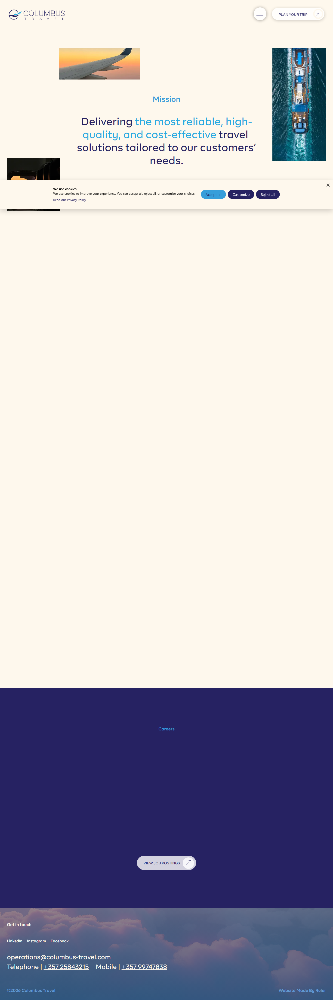



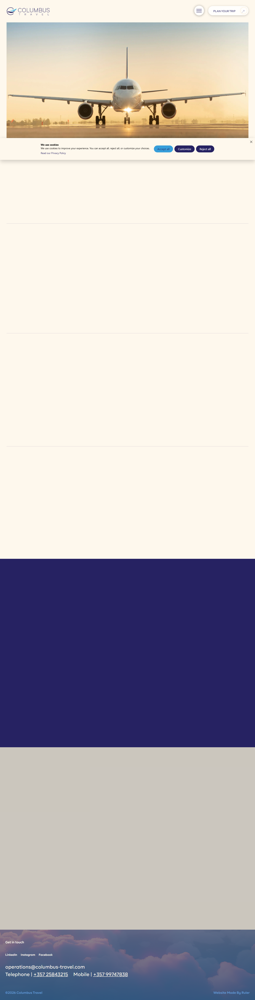

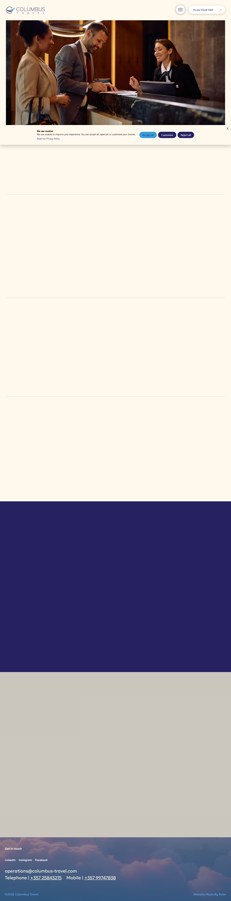

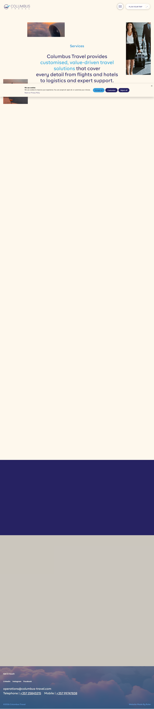

### Section Clips (screens/sections/)

*Clipped individual sections and components*

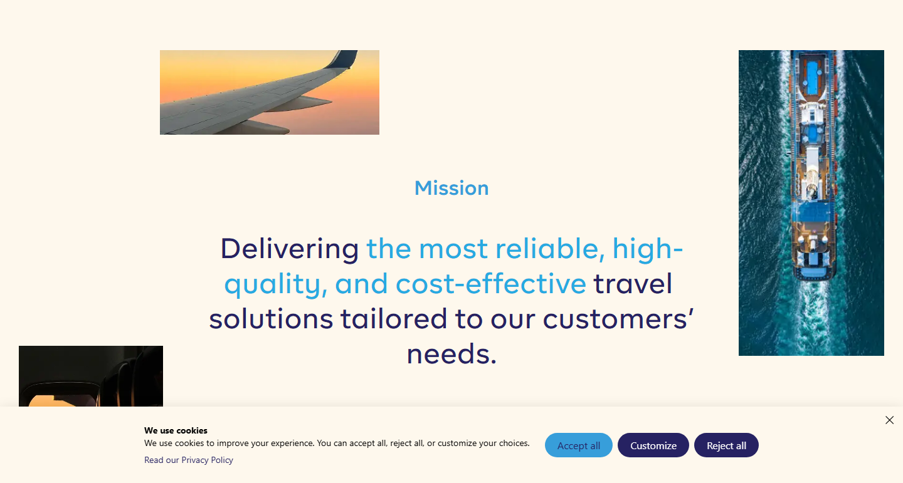

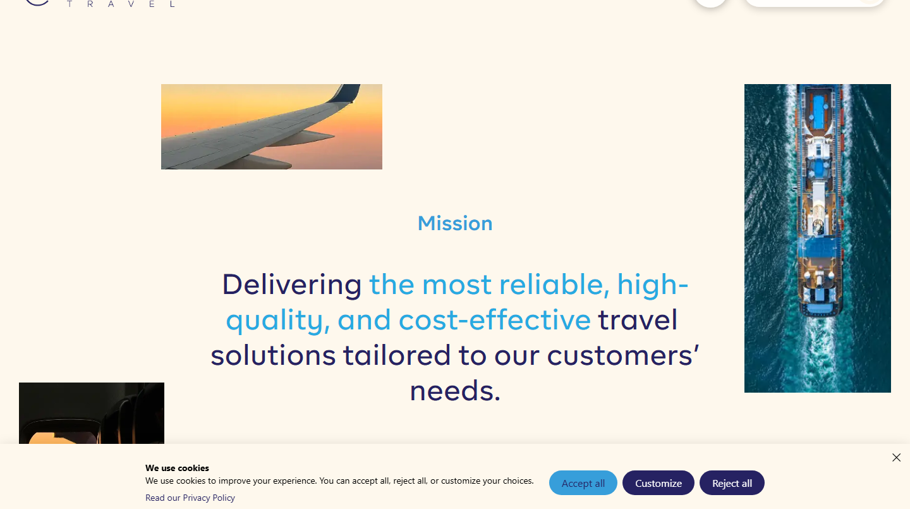


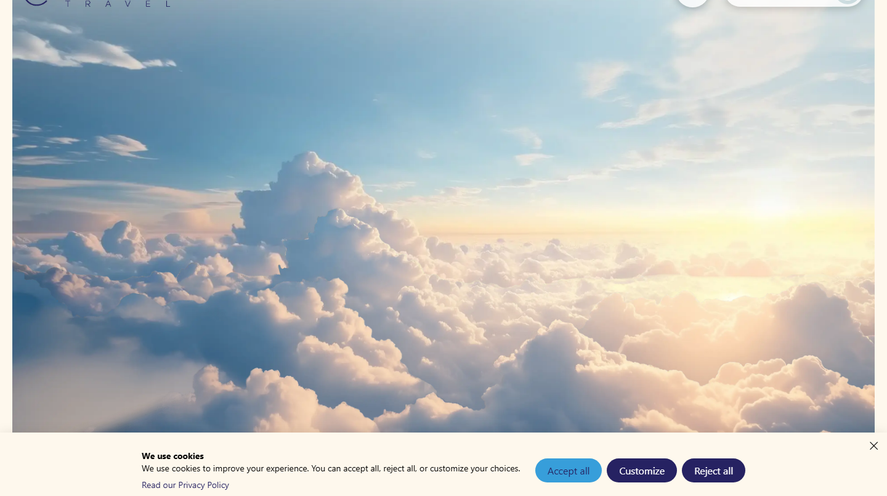

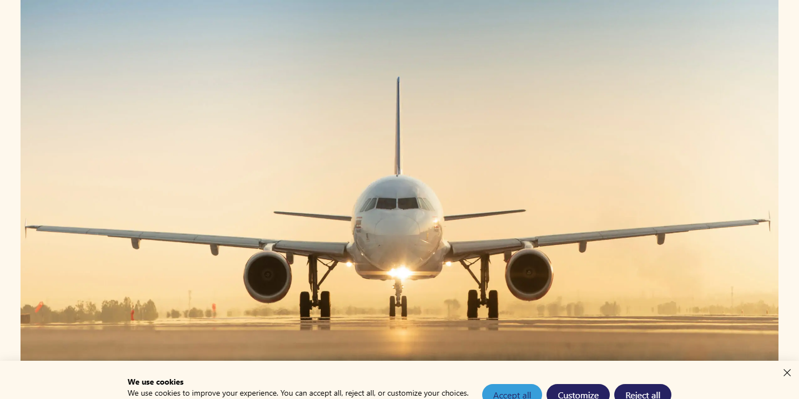

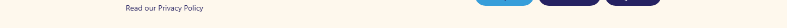

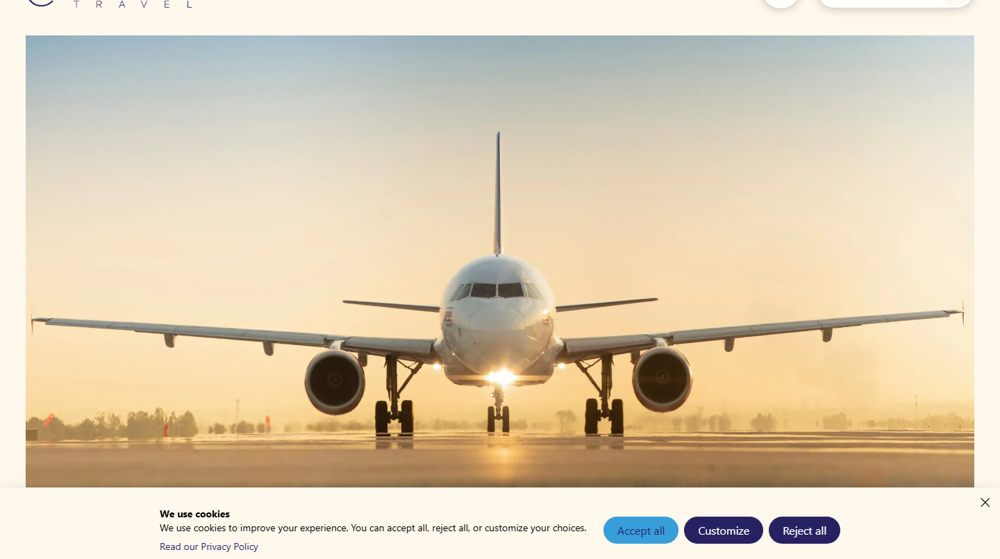


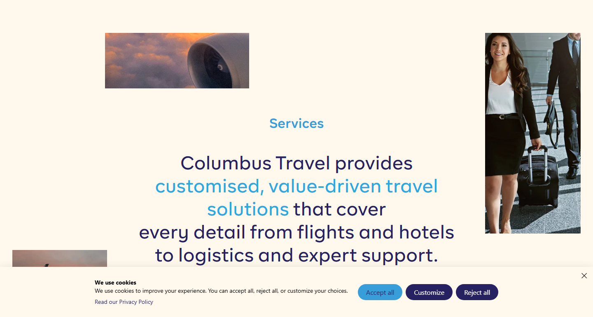

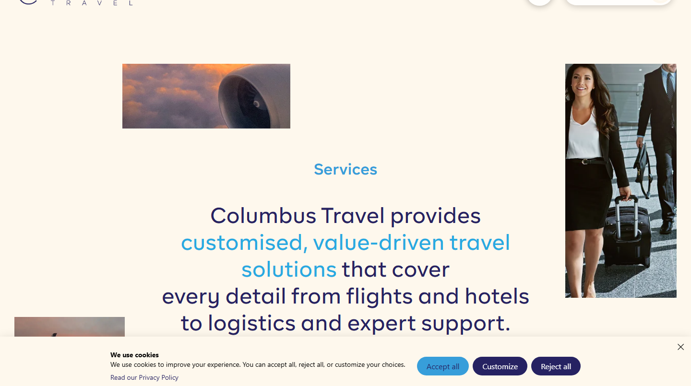

### Interaction States (screens/states/)

*Hover, focus, and active state captures*

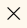


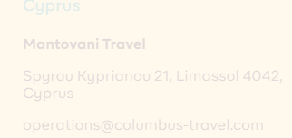

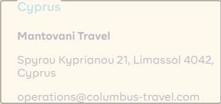

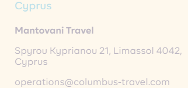


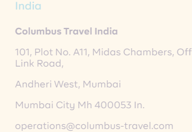

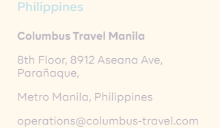


### Screenshot Index (screens/INDEX.md)

# Screenshot Index

## Scroll Journey

> Shows the cinematic state at each point of the page

| Scroll | Y Position | File |
|--------|-----------|------|
| 0% | 0px | `screens/scroll/scroll-000.png` |
| 17% | 3095px | `screens/scroll/scroll-017.png` |
| 33% | 6008px | `screens/scroll/scroll-033.png` |
| 50% | 9104px | `screens/scroll/scroll-050.png` |
| 67% | 12199px | `screens/scroll/scroll-067.png` |
| 83% | 15112px | `screens/scroll/scroll-083.png` |
| 100% | 18207px | `screens/scroll/scroll-100.png` |

## Pages

| Page | URL | File |
|------|-----|------|
| Home - Columbus Travel | `https://columbus-travel.com/` | `screens/pages/home.png` |
| About - Columbus Travel | `https://columbus-travel.com/about/` | `screens/pages/about.png` |
| Services - Columbus Travel | `https://columbus-travel.com/services/` | `screens/pages/services.png` |
| Flights - Columbus Travel | `https://columbus-travel.com/service/flights/` | `screens/pages/service-flights.png` |
| Hotels - Columbus Travel | `https://columbus-travel.com/service/hotels/` | `screens/pages/service-hotels.png` |

## Sections

| Page | Section | File |
|------|---------|------|
| home | #1 (section) | `screens/sections/home-section-1.png` |
| home | #7 (nav) | `screens/sections/home-section-7.png` |
| about | #1 (section) | `screens/sections/about-section-1.png` |
| about | #7 (nav) | `screens/sections/about-section-7.png` |
| services | #1 (section) | `screens/sections/services-section-1.png` |
| services | #8 (nav) | `screens/sections/services-section-8.png` |
| service-flights | #1 (section) | `screens/sections/service-flights-section-1.png` |
| service-flights | #2 (section) | `screens/sections/service-flights-section-2.png` |
| service-flights | #9 (nav) | `screens/sections/service-flights-section-9.png` |
| service-hotels | #1 (section) | `screens/sections/service-hotels-section-1.png` |
| service-hotels | #2 (section) | `screens/sections/service-hotels-section-2.png` |
| service-hotels | #9 (nav) | `screens/sections/service-hotels-section-9.png` |

## Homepage Screenshots (screenshots/)


